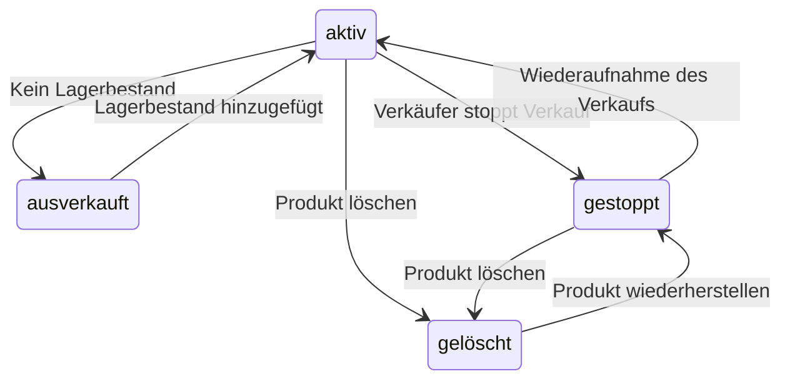
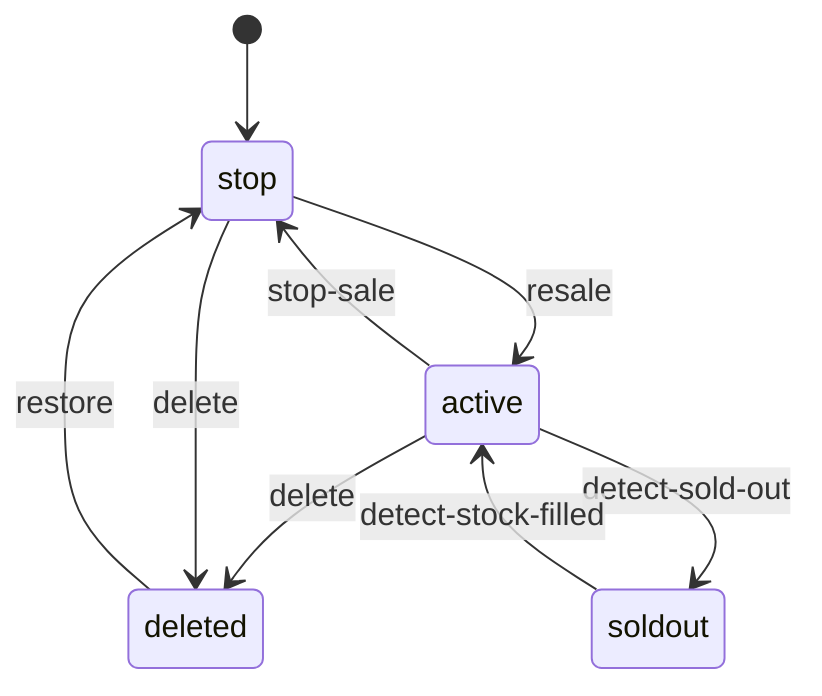

## Zu viele Zustände!


Wer viel in der Branche arbeitet, wird feststellen, dass es wirklich für jede Kleinigkeit einen Zustand gibt. 

Zum Beispiel gibt es zahlreiche Zustände wie den Anmeldezustand eines Benutzers, den Bestellstatus, den Zahlungsstatus usw.

Diese Zustände werden in der Regel im Code oder in der Datenbank gespeichert und genutzt, um je nach Zustand verschiedene Logiken auszuführen.

## Prämisse
Zwar steht auch das von REST gehandhabte Daten selbst für "Representational State Transfer", was sich mit Zuständen befasst, aber in diesem Text wird ein enger gefasstes Verständnis von Zuständen betrachtet.

Angenommen, es gibt einen JSON-Datensatz wie den folgenden
```json
{
    "name": "John",
    "age": 30,
    "state": "active"
}
```

In REST wird der gesamte Datensatz als Zustand betrachtet, aber in diesem Artikel wird speziell ein Feld wie `state` als Zustand angesehen und erklärt.
> Natürlich könnte man im FSM den gesamten Datensatz als Zustand behandeln, aber bei vielen Zuständen wird die Anzahl der möglichen Zweige enorm zunehmen, was nicht ideal ist.

## Problem
Normalerweise verwenden wir `if-else`- oder `switch-case`-Anweisungen, um bei der Verwaltung von Zuständen verschiedene Logiken auszuführen.

Je mehr Zustände es jedoch gibt, desto komplexer wird der Code und desto schwerer ist er zu warten.

In meinem Fall, wo ich auf verschiedenen Shopping-Plattformen den Zustand von Produkten, Bestellungen und Ansprüchen verwalte, habe ich mir viele Gedanken darüber gemacht, wie der Zustand eines Produkts in den aktuellen Dienstzustand umgewandelt werden kann.

Wenn man tatsächlich Produkte basierend auf simplen if-else-Logiken schreibt, kann der Code wie im Folgenden komplex werden:

```go
if product.State == "active" {
    if product.Stock == 0 {
        // Wenn kein Lagerbestand vorhanden ist
        product.State = "soldout"
    }
	if action.Type == "stop" {
        // Verkauf stoppen
        product.State = "stop"
    }
    if action.Type == "delete" {
        // Produkt löschen
        product.State = "deleted"
    }
} else if product.State == "soldout" {
    if product.Stock > 0 {
        // Wenn Lagerbestand hinzugefügt wird
        product.State = "active"
    }
} else if product.State == "stop" {
    if action.Type == "resale" {
        // Wiederverkauf des Produkts
        product.State = "active"
    }
	if action.Type == "delete" {
        // Produkt löschen
        product.State = "deleted"
    }
} else if product.State == "deleted" {
    if action.Type == "restore" {
        // Produkt wiederherstellen
        product.State = "stop"
    }
} ...
```
Es mag scheinen, dass die innere Logik nicht das Problem ist, aber wenn man aufgrund des Zustands komplexe Logiken ausführen muss, wird der Code schnell kompliziert.
> Persönlich finde ich den aktuellen Code schon komplex.

Die Anzahl der Zustände trägt ihren Teil dazu bei. Die Zustände im Code müssen vom Entwickler im Gedächtnis behalten werden, und durch das versehentliche Weglassen von `!` oder das falsche Vergleichen von Zuständen können jederzeit menschliche Fehler auftreten.

Wenn Anforderungen doppelte `if`-Anweisungen oder sogar dreifache erfordern, um Zustände zu verarbeiten, wird der Code umso komplizierter und die Verwaltungskosten zwangsläufig höher.

## FSM (Finite State Machine): Endlicher Zustandsautomat
Um solche Zustände effizienter zu verwalten, werfen wir einen Blick auf den endlichen Zustandsautomaten (FSM). 

Ein endlicher Zustandsautomat definiert Zustände und Ereignisse und beschreibt Übergänge zwischen Zuständen. Obwohl es häufig in der Spieleentwicklung verwendet wird, kann es auch bei einer Vielzahl von Zuständen zur Verwaltung eingesetzt werden.

Die allgemeinen Elemente sind:


1. Zustand (State): Definiert einen Zustand.
2. Ereignis (Event): Definiert die Ereignisse, die Zustandsübergänge auslösen.
3. Übergang (Transition): Definiert die Zustandsübergänge.
4. Aktion (Action): Definiert die Logik, die bei Zustandsübergängen ausgeführt wird.

Das Konzept ist einfach. Eine Ansammlung von Ereignissen bildet das FSM.

Um dies besser zu verstehen, schauen wir uns an, wie der oben gezeichnete `if`-Bedingungsbaum als Diagramm aussieht.

Jeder Start- und Endpunkt eines Pfeils steht für einen Zustand, und der Pfeil selbst steht für eine Aktion.


Während der Planungsphase erhält man oft solche Zustandsdiagramme, und es ist leicht zu verstehen, dass der daraus abgeleitete Code ein FSM ist.

## FSM in Go
Es gibt viele Bibliotheken zur Zustandsverwaltung, aber für diesen Beitrag nutzen wir die Bibliothek [`looplab/fsm`](https://github.com/looplab/fsm).

### Installation
```shell
go get github.com/looplab/fsm
```

### Beispiel 
Schauen wir uns an, wie der zuvor implementierte komplexe (?) `if-else`-Satz als FSM umgesetzt werden kann.

```go
	fsm := fsm.NewFSM(
    "active", // Initialzustand
    fsm.Events{
        {Name: "detect-sold-out", Src: []string{"active"}, Dst: "soldout"},
        {Name: "stop-sale", Src: []string{"active"}, Dst: "stop"},
        {Name: "delete", Src: []string{"active", "stop"}, Dst: "deleted"},
        {Name: "detect-stock-filled", Src: []string{"soldout"}, Dst: "active"},
        {Name: "resale", Src: []string{"stop"}, Dst: "active"},
        {Name: "restore", Src: []string{"deleted"}, Dst: "stop"},
    },
    fsm.Callbacks{
        "detect-sold-out": func(ctx context.Context, e *fsm.Event) {
            product, ok := e.Args[0].(Product)
            if !ok {
                e.Err = errors.New("invalid product")
                return
            }
    
            // Wenn Lagerbestand vorhanden ist, nicht zu 'ausverkauft' wechseln
            if product.Stock > 0 {
                e.Dst = e.Src
                return
            }
        },
        "detect-stock-filled": func(ctx context.Context, e *fsm.Event) {
            product, ok := e.Args[0].(Product)
            if !ok {
                e.Err = errors.New("invalid product")
                return
            }
        
            // Wenn kein Lagerbestand vorhanden ist, nicht zu 'aktiv' wechseln
            if product.Stock == 0 {
                e.Dst = e.Src
                return
            }
        },
    },
)
```
In Code ausgedrückt sieht es wie folgt aus:

```go
    fsm.Events{
        {Name: "detect-sold-out", Src: []string{"active"}, Dst: "soldout"},
        {Name: "stop-sale", Src: []string{"active"}, Dst: "stop"},
        {Name: "delete", Src: []string{"active", "stop"}, Dst: "deleted"},
        {Name: "detect-stock-filled", Src: []string{"soldout"}, Dst: "active"},
        {Name: "resale", Src: []string{"stop"}, Dst: "active"},
        {Name: "restore", Src: []string{"deleted"}, Dst: "stop"},
    },
```
Dieser Teil definiert die Ereignisse. Ereignisse wie `detect-sold-out`, `stop-sale`, `delete` werden definiert und die Zustandsübergänge für jedes Ereignis festgelegt.
Diese Funktion führt automatisch einen Übergang im FSM von `Src` nach `Dst` durch, wenn die `event_name`-Funktion mit übereinstimmendem `Src` aufgerufen wird.

```go
    fsm.Callbacks{
        "detect-sold-out": func(ctx context.Context, e *fsm.Event) {
            product, ok := e.Args[0].(Product)
            if !ok {
                e.Err = errors.New("invalid product")
                return
            }
    
            // Wenn Lagerbestand vorhanden ist, nicht zu 'ausverkauft' wechseln
            if product.Stock > 0 {
                e.Dst = e.Src
                return
            }
        },
        "detect-stock-filled": func(ctx context.Context, e *fsm.Event) {
            product, ok := e.Args[0].(Product)
            if !ok {
                e.Err = errors.New("invalid product")
                return
            }
        
            // Wenn kein Lagerbestand vorhanden ist, nicht zu 'aktiv' wechseln
            if product.Stock == 0 {
                e.Dst = e.Src
                return
            }
        },
    },
```
Callbacks definieren die Logik, die während des Aufrufs eines Ereignisses ausgeführt wird. Die Logik für `resale`, `restore`-Ereignisse ist einfach eine Änderung des Zustands, sodass es keinen separaten Callback dafür gibt, da der Status innerhalb des FSM verwaltet wird.
Allerdings verweisen `detect-sold-out` und `detect-stock-filled` auf das `Stock`-Feld der Ressource `product`, sodass im Inneren ein `Argument` verwendet wird, um es zu übergeben.

`e.Args` ist das Argument, das beim Aufruf des Ereignisses im FSM übergeben wird. Es kann durch `fsm.Event(ctx, "{event_name}", product)` aufgerufen werden, um in der Callback-Funktion auf `e.Args[0]` zu zugreifen.

Testen wir nun, ob es wie beabsichtigt funktioniert.

```go
	ctx := context.Background()

	// Produkt, das keinen Lagerbestand, aber verkaufsaktiv ist
	product := Product{
		State: "active",
		Stock: 0,
	}

	// Überprüfen und Zustand ändern
	if err := fsm.Event(ctx, "detect-sold-out", product); err != nil {
		log.Fatal(err)
	}
	product.State = fsm.Current()
	fmt.Printf("Produktzustand: %s\n", product.State)

	// Verkäufer hat den Lagerbestand auf 10 erhöht
	product.Stock = 10
	if err := fsm.Event(ctx, "detect-stock-filled", product); err != nil {
		log.Fatal(err)
	}
	product.State = fsm.Current()
	fmt.Printf("Produktzustand: %s\n", product.State)

	// Verkäufer hat den Verkauf gestoppt
	if err := fsm.Event(ctx, "stop-sale"); err != nil {
		log.Fatal(err)
	}
	product.State = fsm.Current()
	fmt.Printf("Produktzustand: %s\n", product.State)

	// Wiederaufnahme des Verkaufs durch den Verkäufer
	if err := fsm.Event(ctx, "resale"); err != nil {
		log.Fatal(err)
	}
	product.State = fsm.Current()
	fmt.Printf("Produktzustand: %s\n", product.State)

	// Produkt wurde vom Verkäufer gelöscht
	if err := fsm.Event(ctx, "delete"); err != nil {
		log.Fatal(err)
	}
	product.State = fsm.Current()
	fmt.Printf("Produktzustand: %s\n", product.State)

	// Gelöschtes Produkt wurde vom Verkäufer wiederhergestellt
	if err := fsm.Event(ctx, "restore"); err != nil {
		log.Fatal(err)
	}
	product.State = fsm.Current()
	fmt.Printf("Produktzustand: %s\n", product.State)
```

Wenn der obige Code ausgeführt wird, ergeben sich folgende Ergebnisse:

```shell
Produktzustand: soldout
Produktzustand: active
Produktzustand: stop
Produktzustand: active
Produktzustand: deleted
Produktzustand: stop
```
Man kann sehen, dass der Zustand je nach Aktion ändert.

### Visualisierung
FSM bietet eine Visualisierungsfunktion. Nicht nur diese Bibliothek, sondern viele, die sich auf FSM stützen, unterstützen eine ordnungsgemäße Visualisierung durch Tools wie Mermaid.

```go
	mermaid, err := fsm.VisualizeWithType(f, fsm.MERMAID)
    if err != nil {
        log.Fatal(err)
    }
    
    fmt.Println(mermaid)
```
Mit der Funktion `fsm.VisualizeWithType` kann man es visualisieren und es gibt verschiedene Visualisierungsformate wie mermaid, graphviz usw.

Der Ausgabe sieht folgendermaßen aus:
```shell
stateDiagram-v2
    [*] --> stop
    active --> deleted: delete
    active --> soldout: detect-sold-out
    active --> stop: stop-sale
    deleted --> stop: restore
    soldout --> active: detect-stock-filled
    stop --> deleted: delete
    stop --> active: resale
```

Da mein Blog `mermaid` unterstützt, sieht das visualisierte Ergebnis wie folgt aus:



Es kann ziemlich sauber visualisiert werden.

Darüber hinaus gibt es viele Möglichkeiten für Visualisierungen, und bei Bedarf könnte man es in ein Bild umwandeln, sodass jemand im Internet anhand eines Links den Zustandsfluss sehen kann.

## Fazit
Tatsächlich ist **FSM das Werkzeug, das den Code nicht zwangsläufig reduziert.** Es könnte sogar den Codeumfang durch die Notwendigkeit zur Initialisierung und für Ausnahmen erhöhen.
> Es mag nicht sehr schön aussehen, da alles in die main-Funktion geschrieben wurde, aber in der Praxis würden Callbacks und Ereignisse aufgeteilt und modulhaft organisiert, während die Definition der Zustände und Ereignisse separat verwaltet würde.

Nichtsdestotrotz wird es eingesetzt, um nicht nur den Codefluss zu reduzieren, sondern um Zustandsströme und -beziehungen klar zu definieren und durch Visualisierung leichter verwaltbar zu machen.

Durch die Definition des Zustandstransfers mit klaren `Src`- und `Dst`-Beschreibungen und die Festlegung der Handlung durch `Callbacks` kann die Lesbarkeit und Wartbarkeit des Codes erhöht und die Komplexität selbst bei einer Vielzahl von Zuständen reduziert werden.

## Vollständiger Code
- [Github](https://github.com/YangTaeyoung/go-fsm-demo)

## Referenzen
- https://github.com/looplab/fsm
- https://de.wikipedia.org/wiki/Endlicher_Automat
