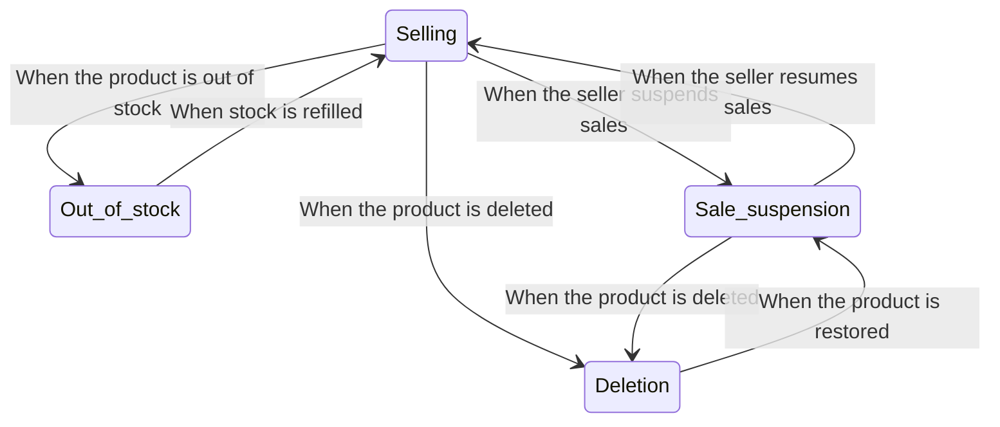
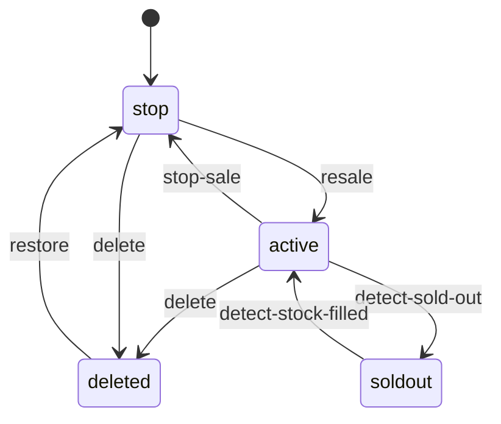

## Too Many States!


When working in the industry, you begin to notice that there’s a state for even the smallest details.

For example, there are states like user login status, order status, payment status, etc.

These states are usually stored and managed in code or a database and are used to perform different logic based on the state.

## Prerequisite
The data handled in REST is also related to state as it stands for Representational State Transfer, but this article will deal with a more narrow definition of state.

Assume we have the following JSON record:
```json
{
    "name": "John",
    "age": 30,
    "state": "active"
}
```

In REST, the entire record would be considered a state, but in this article, we will consider specific fields like `state` as the state.
> Of course, in FSMs, the entire record can also be regarded as a state, but it's not suitable for cases where many state branches would arise.

## Problem
Typically, when managing state, an `if-else` or `switch-case` statement is used to implement different logic based on the state.

However, the more states you have, the more complex the code becomes, making maintenance difficult.

Given my experience managing the states of various resources on different shopping platforms like products, orders, and claims, I pondered a lot about converting the state of a product to the current service's state.

Inevitably, writing the product’s state using simple if-else logic can lead to complex code, as shown below.

```go
if product.State == "active" {
    if product.Stock == 0 {
        // Out of stock
        product.State = "soldout"
    }
	if action.Type == "stop" {
        // Stop sales
        product.State = "stop"
    }
    if action.Type == "delete" {
        // Delete product
        product.State = "deleted"
    }
} else if product.State == "soldout" {
    if product.Stock > 0 {
        // Stock refilled
        product.State = "active"
    }
} else if product.State == "stop" {
    if action.Type == "resale" {
        // Resell product
        product.State = "active"
    }
	if action.Type == "delete" {
        // Delete product
        product.State = "deleted"
    }
} else if product.State == "deleted" {
    if action.Type == "restore" {
        // Restore product
        product.State = "stop"
    }
} ...
```
Though one might think it’s not a big deal due to the minimal internal code, if various logic needs to be performed based on the state, complexity would rise drastically. 
> Personally, I found it complex already with just this logic.

Having so many states plays a part too. The states embedded within the code must be recollected by the developer's memory, which can lead to human errors like forgetting a `!` in an `if` statement, or comparing the wrong state.

According to requirements, double or even triple nested `if` statements could be used to handle states, which again complicates the code and increases management costs.

## FSM (Finite State Machine)
Now let’s learn about finite state machines (FSM) to manage states more efficiently.

FSM is about defining states and events and state transitions. It’s a concept widely used in game development but can be introduced to manage states when they are simply too many.

The general components are as follows:


1. State: Define the states.
2. Event: Define events that trigger state transitions.
3. Transition: Define the state transitions.
4. Action: Define the logic to perform during a state transition.

It’s a simple concept. You can view each Event collection as the FSM itself.

To understand this better, let’s express the previous if-statements as a diagram.

Each arrow’s start and end points represent states, and the arrows represent actions.


During planning, you might receive such state diagrams. It’s easy to understand that converting this into code is what FSM is about.

## FSM with Go
There are many state management libraries for implementation, but in this post, we will use the [`looplab/fsm`](https://github.com/looplab/fsm) library for our implementation.

### Installation
```shell
go get github.com/looplab/fsm
```

### Example 
Let’s implement the somewhat complex if-else statements we had earlier with FSM:
```go
	fsm := fsm.NewFSM(
    "active", // Initial state
    fsm.Events{
        {Name: "detect-sold-out", Src: []string{"active"}, Dst: "soldout"},
        {Name: "stop-sale", Src: []string{"active"}, Dst: "stop"},
        {Name: "delete", Src: []string{"active", "stop"}, Dst: "deleted"},
        {Name: "detect-stock-filled", Src: []string{"soldout"}, Dst: "active"},
        {Name: "resale", Src: []string{"stop"}, Dst: "active"},
        {Name: "restore", Src: []string{"deleted"}, Dst: "stop"},
    },
    fsm.Callbacks{
        "detect-sold-out": func(ctx context.Context, e *fsm.Event) {
            product, ok := e.Args[0].(Product)
            if !ok {
                e.Err = errors.New("invalid product")
                return
            }
    
            // Don’t change to soldout if there is stock
            if product.Stock > 0 {
                e.Dst = e.Src
                return
            }
        },
        "detect-stock-filled": func(ctx context.Context, e *fsm.Event) {
            product, ok := e.Args[0].(Product)
            if !ok {
                e.Err = errors.New("invalid product")
                return
            }
        
            // Don’t change to active if there is no stock
            if product.Stock == 0 {
                e.Dst = e.Src
                return
            }
        },
    },
)
```
The code would look as follows:
```go
    fsm.Events{
        {Name: "detect-sold-out", Src: []string{"active"}, Dst: "soldout"},
        {Name: "stop-sale", Src: []string{"active"}, Dst: "stop"},
        {Name: "delete", Src: []string{"active", "stop"}, Dst: "deleted"},
        {Name: "detect-stock-filled", Src: []string{"soldout"}, Dst: "active"},
        {Name: "resale", Src: []string{"stop"}, Dst: "active"},
        {Name: "restore", Src: []string{"deleted"}, Dst: "stop"},
    },
```
First, this part defines the events. Events like `detect-sold-out`, `stop-sale`, `delete`, etc., are defined, and state transitions for each event are defined.
This function automatically transitions the internal FSM state if its Src matches when `fsm.Event(ctx, "{event_name}")` function is called. 

```go
    fsm.Callbacks{
        "detect-sold-out": func(ctx context.Context, e *fsm.Event) {
            product, ok := e.Args[0].(Product)
            if !ok {
                e.Err = errors.New("invalid product")
                return
            }
    
            // Don’t change to soldout if there is stock
            if product.Stock > 0 {
                e.Dst = e.Src
                return
            }
        },
        "detect-stock-filled": func(ctx context.Context, e *fsm.Event) {
            product, ok := e.Args[0].(Product)
            if !ok {
                e.Err = errors.New("invalid product")
                return
            }
        
            // Don’t change to active if there is no stock
            if product.Stock == 0 {
                e.Dst = e.Src
                return
            }
        },
    },
```
Callbacks define the logic to execute when each event is called. Events like resale, restore, etc., simply change states, so we handle them within FSM by changing the internal state and didn't write separate callbacks.
However, for `detect-sold-out` and `detect-stock-filled`, since they reference the `Stock` field of the `product` resource separately, we decided to utilize additional arguments within FSM to use them.

`e.Args` allows passing arguments upon event calls in FSM, as `fsm.Event(ctx, "{event_name}", product)` is called, the callback function can refer to the `product` with `e.Args[0]`.

Let's test if it works as intended:

```go
	ctx := context.Background()

	// When stock is 0 but the product is active
	product := Product{
		State: "active",
		Stock: 0,
	}

	// Check stock and change the state
	if err := fsm.Event(ctx, "detect-sold-out", product); err != nil {
		log.Fatal(err)
	}
	product.State = fsm.Current()
	fmt.Printf("Product state: %s\n", product.State)

	// Seller refills the stock to 10
	product.Stock = 10
	if err := fsm.Event(ctx, "detect-stock-filled", product); err != nil {
		log.Fatal(err)
	}
	product.State = fsm.Current()
	fmt.Printf("Product state: %s\n", product.State)

	// Seller stops the sale
	if err := fsm.Event(ctx, "stop-sale"); err != nil {
		log.Fatal(err)
	}
	product.State = fsm.Current()
	fmt.Printf("Product state: %s\n", product.State)

	// Seller resumes the sale
	if err := fsm.Event(ctx, "resale"); err != nil {
		log.Fatal(err)
	}
	product.State = fsm.Current()
	fmt.Printf("Product state: %s\n", product.State)

	// Seller deletes the product
	if err := fsm.Event(ctx, "delete"); err != nil {
		log.Fatal(err)
	}
	product.State = fsm.Current()
	fmt.Printf("Product state: %s\n", product.State)

	// Seller restores the deleted product
	if err := fsm.Event(ctx, "restore"); err != nil {
		log.Fatal(err)
	}
	product.State = fsm.Current()
	fmt.Printf("Product state: %s\n", product.State)
```

Running the above code will result in the following:

```shell
Product state: soldout
Product state: active
Product state: stop
Product state: active
Product state: deleted
Product state: stop
```
As shown, the state changes according to the action.

### Visualization
FSM offers visualization capabilities. Not only this library, but many tools that pledge FSM support visualization through tools like Mermaid.

```go
	mermaid, err := fsm.VisualizeWithType(f, fsm.MERMAID)
    if err != nil {
        log.Fatal(err)
    }
    
    fmt.Println(mermaid)
```
You can visualize using the `fsm.VisualizeWithType` function as shown above, and it can be visualized in various forms such as mermaid or graphviz.

The output is as follows:
```shell
stateDiagram-v2
    [*] --> stop
    active --> deleted: delete
    active --> soldout: detect-sold-out
    active --> stop: stop-sale
    deleted --> stop: restore
    soldout --> active: detect-stock-filled
    stop --> deleted: delete
    stop --> active: resale
```

Since my blog supports `mermaid`, the visualization using this tool is as follows:



You can see it allows quite a clean visualization.

Beyond this, various visualization methods are possible, and it might be possible to turn these into images and deploy them as links, allowing others to view state changes visually.

## Conclusion
From a code perspective, **FSM itself is not a tool that reduces code lines.** In fact, the code might increase to accommodate FSM initialization and proper exception handling.
> That doesn’t mean it looks bad; though the main function has everything here, in real-world scenarios, callbacks and events would be appropriately separated into modules, and the state and event definitions would be managed separately.

Nonetheless, the reason to use it is not to minimize code but rather to clearly define the state flow and relationships, making it easier to manage through visualization.

Through the clear `Src` and `Dst` definitions for state transitions and using callbacks to define actions, the code’s readability and maintainability are improved, reducing complexity even when numerous states are present.

## Full Code
- [Github](https://github.com/YangTaeyoung/go-fsm-demo)

## Reference
- https://github.com/looplab/fsm
- https://en.wikipedia.org/wiki/Finite-state_machine