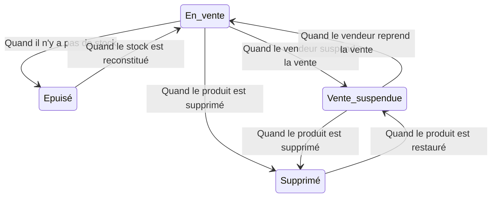
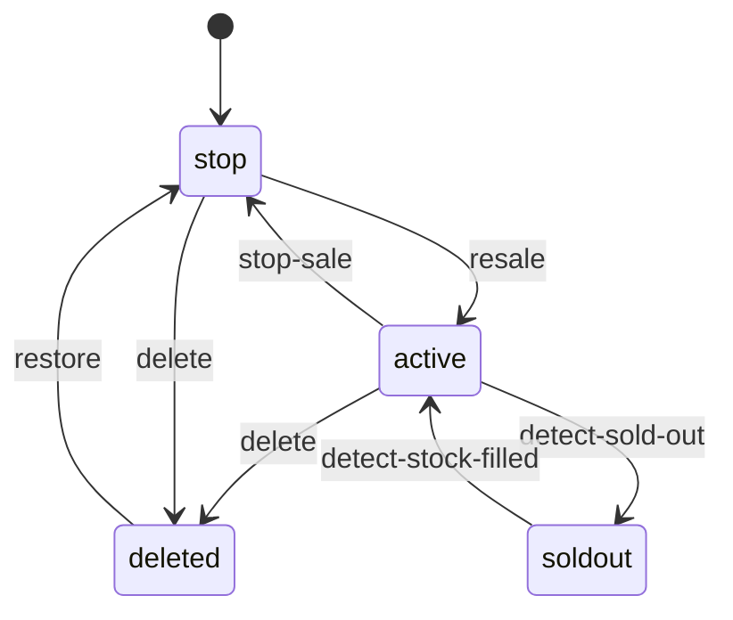

## Trop d'états !


En travaillant beaucoup dans l'industrie, on se rend compte qu'il y a un état pour chaque petite chose, aussi insignifiante soit-elle.

Par exemple, il existe de nombreux états comme l'état de connexion de l'utilisateur, l'état de la commande, l'état du paiement, etc.

Ces états sont généralement stockés dans du code ou des bases de données et utilisés pour exécuter des logiques différentes selon l'état.

## Préambule
Les données gérées dans REST sont également liées à l'état en tant qu'acronyme de Representational State Transfer, mais cet article traitera des états dans un sens plus restreint.

Par exemple, supposons qu'il y a un enregistrement JSON comme suit
```json
{
    "name": "John",
    "age": 30,
    "state": "active"
}
```

Dans REST, l'enregistrement entier ci-dessus est considéré comme un état, mais dans cet article, seuls des champs spécifiques tels que `state` seront considérés et expliqués comme étant l'état.
> Bien sûr, dans FSM, l'enregistrement complet peut être considéré comme un état, mais en fonction du nombre d'états, de nombreuses ramifications peuvent survenir, ce qui n'est pas souhaitable.

## Problème
En général, lors de la gestion de l'état, on implémente la logique en utilisant des instructions `if-else` ou `switch-case` pour exécuter différentes logiques selon l'état.

Cependant, plus il y a d'états, plus le code devient complexe et difficile à maintenir.

Dans mon cas, en gérant les états de divers ressources telles que les produits, les commandes, les réclamations sur diverses plateformes d'achat, j'ai souvent réfléchi à la conversion de l'état d'un produit en l'état actuel du service.

Si nous écrivons l'état d'un produit en utilisant simplement une base de if-else, le code peut devenir quelque peu complexe comme ci-dessous.

```go
if product.State == "active" {
    if product.Stock == 0 {
        // Lorsque le produit est en rupture de stock
        product.State = "soldout"
    }
	if action.Type == "stop" {
        // Arrêter la vente du produit
        product.State = "stop"
    }
    if action.Type == "delete" {
        // Supprimer le produit
        product.State = "deleted"
    }
} else if product.State == "soldout" {
    if product.Stock > 0 {
        // Lorsque le stock du produit est reconstitué
        product.State = "active"
    }
} else if product.State == "stop" {
    if action.Type == "resale" {
        // Revendre le produit
        product.State = "active"
    }
	if action.Type == "delete" {
        // Supprimer le produit
        product.State = "deleted"
    }
} else if product.State == "deleted" {
    if action.Type == "restore" {
        // Restaurer le produit
        product.State = "stop"
    }
} ...
```
Cela peut sembler peu de code, mais si vous devez exécuter diverses logiques en fonction de l'état, le code peut rapidement devenir complexe.
> Personnellement, même en voyant cette logique maintenant, je trouve cela complexe.

Beaucoup d'états y contribuent. Les états présents dans le code doivent être mémorisés par le développeur, et des erreurs humaines peuvent survenir à tout moment en oubliant un point d'exclamation dans une condition, ou en comparant mal un état.

Selon les exigences, si les états sont traités avec des conditions imbriquées telles que des doubles ou triples `if`, le code correspondant sera complexe et les coûts de gestion augmenteront forcément.

## FSM (Machine à États Finis)
Passons maintenant à une gestion plus efficace des états en découvrant les machines à états finis (FSM).

Une machine à états finis définit des états, des événements ainsi que des transitions d'états. Bien que cela soit couramment utilisé dans le développement de jeux, il peut également être utilisé pour gérer les états lorsqu'il y en a trop.

Les composants classiques sont les suivants.


1. État (State) : Définit l'état.
2. Événement (Event) : Définit l'événement de déclenchement de la transition d'état.
3. Transition (Transition) : Définit les transitions d'état.
4. Action (Action) : Définit la logique à exécuter lors d'une transition d'état.

C'est un concept simple. On peut considérer un ensemble d'événements comme un FSM.

Pour mieux comprendre cela, commentons nos précédents `if` sous forme de diagramme.

Chaque point de départ et d'arrivée d'une flèche représente un état, et une flèche représente une action.


Il est facile de comprendre que convertir ce diagramme en code facilite l'interprétation d'un FSM.

## FSM avec Go
Pour implémenter cela, il existe de nombreuses bibliothèques de gestion d'état. Dans cet article, nous allons utiliser la bibliothèque [`looplab/fsm`](https://github.com/looplab/fsm).

### Installation
```shell
go get github.com/looplab/fsm
```


### Exemple
Tentons de réimplémenter notre complexe (ou pas ?) `if-else` en utilisant FSM.
```go
	fsm := fsm.NewFSM(
    "active", // État initial
    fsm.Events{
        {Name: "detect-sold-out", Src: []string{"active"}, Dst: "soldout"},
        {Name: "stop-sale", Src: []string{"active"}, Dst: "stop"},
        {Name: "delete", Src: []string{"active", "stop"}, Dst: "deleted"},
        {Name: "detect-stock-filled", Src: []string{"soldout"}, Dst: "active"},
        {Name: "resale", Src: []string{"stop"}, Dst: "active"},
        {Name: "restore", Src: []string{"deleted"}, Dst: "stop"},
    },
    fsm.Callbacks{
        "detect-sold-out": func(ctx context.Context, e *fsm.Event) {
            product, ok := e.Args[0].(Product)
            if !ok {
                e.Err = errors.New("invalid product")
                return
            }
    
            // Ne pas changer en épuisé si du stock est disponible
            if product.Stock > 0 {
                e.Dst = e.Src
                return
            }
        },
        "detect-stock-filled": func(ctx context.Context, e *fsm.Event) {
            product, ok := e.Args[0].(Product)
            if !ok {
                e.Err = errors.New("invalid product")
                return
            }
        
            // Ne pas changer en actif s'il n'y a pas de stock
            if product.Stock == 0 {
                e.Dst = e.Src
                return
            }
        },
    },
)
```
Ça se traduit par le code suivant.

```go
    fsm.Events{
        {Name: "detect-sold-out", Src: []string{"active"}, Dst: "soldout"},
        {Name: "stop-sale", Src: []string{"active"}, Dst: "stop"},
        {Name: "delete", Src: []string{"active", "stop"}, Dst: "deleted"},
        {Name: "detect-stock-filled", Src: []string{"soldout"}, Dst: "active"},
        {Name: "resale", Src: []string{"stop"}, Dst: "active"},
        {Name: "restore", Src: []string{"deleted"}, Dst: "stop"},
    },
```
Tout d'abord, cette partie définit les événements. Elle définit des événements tels que `detect-sold-out`, `stop-sale`, `delete`, et établit les transitions d'état correspondantes à ces événements. Cette fonction gère automatiquement la transition d'état au sein de FSM quand `fsm.Event(ctx, "{event_name}")` est appelé et que Src correspond.

```go
    fsm.Callbacks{
        "detect-sold-out": func(ctx context.Context, e *fsm.Event) {
            product, ok := e.Args[0].(Product)
            if !ok {
                e.Err = errors.New("invalid product")
                return
            }
    
            // Ne pas changer en épuisé si du stock est disponible
            if product.Stock > 0 {
                e.Dst = e.Src
                return
            }
        },
        "detect-stock-filled": func(ctx context.Context, e *fsm.Event) {
            product, ok := e.Args[0].(Product)
            if !ok {
                e.Err = errors.New("invalid product")
                return
            }
        
            // Ne pas changer en actif s'il n'y a pas de stock
            if product.Stock == 0 {
                e.Dst = e.Src
                return
            }
        },
    },
```
Le callback est la partie définissant la logique exécutée à chaque événement. Parmi les logiques spécifiées dans le `if-else` original, les événements tels que `resale` et `restore` changent uniquement l'état, c'est donc traité par le changement d'état interne du FSM sans nécessiter de callback supplémentaire. Cependant, certains événements comme `detect-sold-out` et `detect-stock-filled` nécessitent l'accès à certaines ressources du produit, donc les `Arguments` sont utilisés à l'intérieur pour le traitement.

`e.Args` définissent les arguments passés lors de l'appel de l'événement dans FSM, et peuvent être référencés à l'intérieur des fonctions de callback en exécutant `fsm.Event(ctx, "{event_name}", product)`.

Testons sa performance :

```go
	ctx := context.Background()

	// Lorsque le stock est nul mais que le produit est en vente
	product := Product{
		State: "active",
		Stock: 0,
	}

	// Vérifier le stock avant de changer l'état
	if err := fsm.Event(ctx, "detect-sold-out", product); err != nil {
		log.Fatal(err)
	}
	product.State = fsm.Current()
	fmt.Printf("État du produit : %s\n", product.State)

	// Le vendeur a reconstitué le stock à 10
	product.Stock = 10
	if err := fsm.Event(ctx, "detect-stock-filled", product); err != nil {
		log.Fatal(err)
	}
	product.State = fsm.Current()
	fmt.Printf("État du produit : %s\n", product.State)

	// Le vendeur a suspendu la vente
	if err := fsm.Event(ctx, "stop-sale"); err != nil {
		log.Fatal(err)
	}
	product.State = fsm.Current()
	fmt.Printf("État du produit : %s\n", product.State)

	// Le vendeur a repris la vente
	if err := fsm.Event(ctx, "resale"); err != nil {
		log.Fatal(err)
	}
	product.State = fsm.Current()
	fmt.Printf("État du produit : %s\n", product.State)

	// Le vendeur a supprimé le produit
	if err := fsm.Event(ctx, "delete"); err != nil {
		log.Fatal(err)
	}
	product.State = fsm.Current()
	fmt.Printf("État du produit : %s\n", product.State)

	// Le vendeur a restauré le produit supprimé
	if err := fsm.Event(ctx, "restore"); err != nil {
		log.Fatal(err)
	}
	product.State = fsm.Current()
	fmt.Printf("État du produit : %s\n", product.State)
```

Lorsque vous exécutez le code ci-dessus, vous obtenez les résultats suivants :

```shell
État du produit : soldout
État du produit : active
État du produit : stop
État du produit : active
État du produit : deleted
État du produit : stop
```
Ainsi, on peut observer que l'état se modifie en fonction des actions.

### Visualisation
FSM offre une fonctionnalité de visualisation. Non seulement cette bibliothèque, mais beaucoup d'outils prônant FSM soutiennent la visualisation adéquate à l'aide d'outils comme Mermaid.

```go
	mermaid, err := fsm.VisualizeWithType(f, fsm.MERMAID)
    if err != nil {
        log.Fatal(err)
    }
    
    fmt.Println(mermaid)
```
Vous pouvez visualiser comme ceci avec fonction `fsm.VisualizeWithType` et adopter divers types de visualisations comme mermaid, graphviz etc.

Le résultat de sortie est le suivant :
```shell
stateDiagram-v2
    [*] --> stop
    active --> deleted: delete
    active --> soldout: detect-sold-out
    active --> stop: stop-sale
    deleted --> stop: restore
    soldout --> active: detect-stock-filled
    stop --> deleted: delete
    stop --> active: resale
```

Mon blog supportant `mermaid`, le résultat de la visualisation serait le suivant :



Il est possible de visualiser de façon plutôt nette.

En outre, diverses méthodes de visualisation sont possibles, selon le besoin, il est possible de créer des images de cela pour montrer aux utilisateurs comment l'état change lors de la visite d'un lien spécifique.

## Conclusion
En fait, lorsqu'on le voit dans le code **FSM n'est pas un outil visant à réduire la quantité de code dans l'immédiat.** En réalité, on peut constater que la quantité de code augmente pour initialiser FSM et gérer correctement les exceptions.
> Ce n'est pas pour dire que ce n'est pas joli, mais dans un contexte professionnel, les callbacks et les événements seront modélisés et gérés de manière modulaire et les sections définissant les états et événements seront isolées pour une gestion distincte.

Cependant, la raison principale de son utilisation n'est pas simplement pour réduire le code mais pour définir clairement le flux et les relations des états et de rendre cela facilement gérable par sa visualisation.

Il réduit la complexité dans un contexte où il y a beaucoup d'états en exprimant la transition des états via des définitions claires de `Src` et `Dst` et en définissant les actions via `Callbacks`, augmentant ainsi la lisibilité et la maintenabilité du code.

## Code Complet
- [Github](https://github.com/YangTaeyoung/go-fsm-demo)

## Références
- https://github.com/looplab/fsm
- https://fr.wikipedia.org/wiki/Machine_%C3%A0_%C3%A9tats_finis