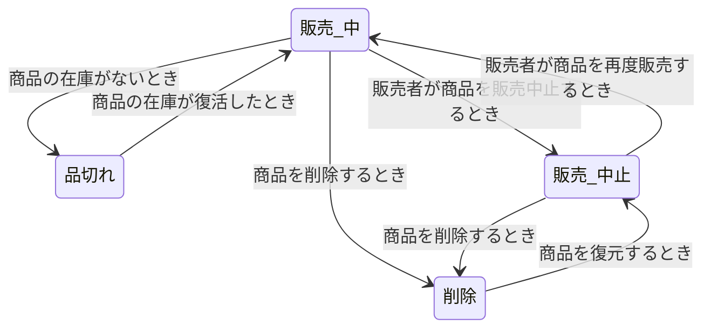
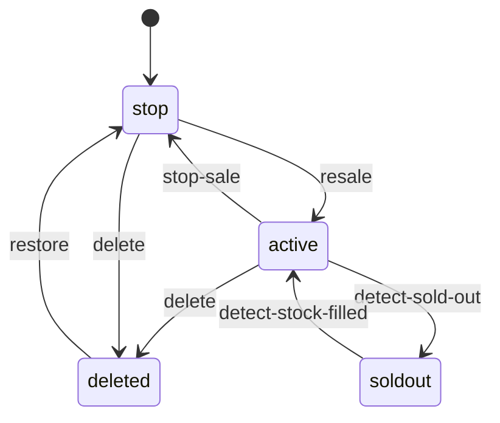

## 状態が多すぎる！


業界で多くの経験を積むと、つまらないことの一つ一つにも状態があることに気付くようになります。

例えば、ユーザーのログイン状態、注文状態、支払い状態など、多くの状態が存在します。

これらの状態は一般的にコードやDBに保存されて管理され、状態に応じて異なるロジックを実行するために使用されます。

## 前提
RESTで扱うデータ自体もまた、Representational State Transferの略称で状態と関連していますが、この記事ではもう少し狭義の状態について扱います。

例えば、次のようなJSONレコードがあると仮定します。
```json
{
    "name": "John",
    "age": 30,
    "state": "active"
}
```

RESTでは上記レコード全体を状態と見なしますが、この記事では`state`のような特定のフィールドを状態と見なし説明します。
> もちろんFSMでも上記全レコードを状態と見なすことができますが、状態数に応じて非常に多くの分岐が発生するため、あまり適していません。

## 問題
一般的に状態を管理する際には、`if-else`文や`switch-case`文を使って状態に応じて異なるロジックを実行するように実装します。

ただし、状態が増えるにつれて、コードは複雑になり、メンテナンスが難しくなります。

私の場合、さまざまなショッピングプラットフォームで商品、注文、クレームなどのリソースの状態を管理する中で、その商品状態を現在サービスの状態に変換することに多くの時間を費やしました。

もし単純なif-else基準で商品の状態を管理するのであれば、以下のようにコードが複雑になりがちです。

```go
if product.State == "active" {
    if product.Stock == 0 {
        // 商品が在庫なしの時
        product.State = "soldout"
    }
	if action.Type == "stop" {
        // 商品販売中止
        product.State = "stop"
    }
    if action.Type == "delete" {
        // 商品削除
        product.State = "deleted"
    }
} else if product.State == "soldout" {
    if product.Stock > 0 {
        // 商品の在庫が復活した時
        product.State = "active"
    }
} else if product.State == "stop" {
    if action.Type == "resale" {
        // 商品再販売
        product.State = "active"
    }
	if action.Type == "delete" {
        // 商品削除
        product.State = "deleted"
    }
} else if product.State == "deleted" {
    if action.Type == "restore" {
        // 商品復元
        product.State = "stop"
    }
} ...
```
内部のコードが少ないため大きな問題ではないと考えることもありますが、状態に応じてさまざまなロジックを実行する必要がある場合、コードは急速に複雑化します。 
> 個人的にはこのロジックだけでも複雑だと感じました。

状態が多いのも一因です。コード内の状態は、完全に開発者が記憶しなければならず、if文で間違って`!`を忘れたり、状況を間違って比較したりする問題でヒューマンエラーがいつでも発生する可能性があります。

要求に応じて二重if文、あるいは三重if文などで状態を処理することになれば、さらにコードは複雑になり、管理のコストは高くなります。

## FSM(Finite State Machine): 有限状態機械
では、状態をより効率的に管理するために有限状態機械（FSM）について学びましょう。

有限状態機械とは、状態とイベントを定義し、状態遷移を定義することです。一般的にゲーム開発で多く利用される概念ですが、単に状態が多すぎる場合にもこれを導入し状態を管理することができます。

一般的な構成要素は次の通りです。


1. 状態(State): 状態を定義します。
2. イベント(Event): 状態遷移を引き起こすイベントを定義します。
3. 状態遷移(Transition): 状態遷移を定義します。
4. 行動(Action): 状態遷移時に行うロジックを定義します。

シンプルな概念です。イベントの集まりをFSMと見ることができます。

これをもう少し簡単に理解するために、先ほどのif文をダイアグラムに表現すると次のようになります。

それぞれの矢印の始まりと終わりは状態を意味し、矢印はアクションを意味します。


企画の際にこのような状態ダイアグラムを手にすることもありますが、実際にこれをコードに移したものがFSMと理解するとわかりやすいです。

## GoにおけるFSM
これを実装するためには多くの状態管理ライブラリがありますが、今回の投稿では[`looplab/fsm`](https://github.com/looplab/fsm)ライブラリを使用して実装してみます。

### インストール
```shell
go get github.com/looplab/fsm
```

### 例
先ほどの複雑な(?) if-else文をFSMで実装してみましょう。
```go
	fsm := fsm.NewFSM(
    "active", // 初期状態
    fsm.Events{
        {Name: "detect-sold-out", Src: []string{"active"}, Dst: "soldout"},
        {Name: "stop-sale", Src: []string{"active"}, Dst: "stop"},
        {Name: "delete", Src: []string{"active", "stop"}, Dst: "deleted"},
        {Name: "detect-stock-filled", Src: []string{"soldout"}, Dst: "active"},
        {Name: "resale", Src: []string{"stop"}, Dst: "active"},
        {Name: "restore", Src: []string{"deleted"}, Dst: "stop"},
    },
    fsm.Callbacks{
        "detect-sold-out": func(ctx context.Context, e *fsm.Event) {
            product, ok := e.Args[0].(Product)
            if !ok {
                e.Err = errors.New("invalid product")
                return
            }
    
            // 在庫があれば品切れに変更しない
            if product.Stock > 0 {
                e.Dst = e.Src
                return
            }
        },
        "detect-stock-filled": func(ctx context.Context, e *fsm.Event) {
            product, ok := e.Args[0].(Product)
            if !ok {
                e.Err = errors.New("invalid product")
                return
            }
        
            // 在庫がなければ販売中に変更しない
            if product.Stock == 0 {
                e.Dst = e.Src
                return
            }
        },
    },
)
```
コードで示すと次のようになります。

```go
    fsm.Events{
        {Name: "detect-sold-out", Src: []string{"active"}, Dst: "soldout"},
        {Name: "stop-sale", Src: []string{"active"}, Dst: "stop"},
        {Name: "delete", Src: []string{"active", "stop"}, Dst: "deleted"},
        {Name: "detect-stock-filled", Src: []string{"soldout"}, Dst: "active"},
        {Name: "resale", Src: []string{"stop"}, Dst: "active"},
        {Name: "restore", Src: []string{"deleted"}, Dst: "stop"},
    },
```
まずこの部分はイベントを定義する部分です。`detect-sold-out`、`stop-sale`、`delete`などの名前を持つイベントを定義し、各イベントが発生した時の状態遷移を定義します。
この関数は`fsm.Event(ctx, "{event_name}")`関数を呼び出す時にSrcが一致する場合、DstにFSM内部状態を自動的に移行します。

```go
    fsm.Callbacks{
        "detect-sold-out": func(ctx context.Context, e *fsm.Event) {
            product, ok := e.Args[0].(Product)
            if !ok {
                e.Err = errors.New("invalid product")
                return
            }
    
            // 在庫があれば品切れに変更しない
            if product.Stock > 0 {
                e.Dst = e.Src
                return
            }
        },
        "detect-stock-filled": func(ctx context.Context, e *fsm.Event) {
            product, ok := e.Args[0].(Product)
            if !ok {
                e.Err = errors.New("invalid product")
                return
            }
        
            // 在庫がなければ販売中に変更しない
            if product.Stock == 0 {
                e.Dst = e.Src
                return
            }
        },
    },
```
コールバックは各イベントが呼び出されたときに実行するロジックを定義する部分です。既存のif-elseに明記されたロジック中で`resale`、`restore`などのイベントは単純に状態だけを変更するので、FSM内部で変更する状態を通して処理することにして、別途コールバックを書きませんでした。しかし、`detect-sold-out`、`detect-stock-filled`の場合には`product`のリソースである`Stock`フィールドを別に参照するため、追加で`Argument`を内部で伝達して使用することにしました。

`e.Args`はFSMでイベントを呼び出す時に伝達する引数を定義するもので、`fsm.Event(ctx, "{event_name}", product)`のように呼び出すと、コールバック関数内部で`e.Args[0]`として`product`を参照することができます。

意図した通りに動作するかテストしてみましょう。 

```go
	ctx := context.Background()

	// 在庫はないが、販売中の商品の場合
	product := Product{
		State: "active",
		Stock: 0,
	}

	// 在庫があるか確認し、状態を変更
	if err := fsm.Event(ctx, "detect-sold-out", product); err != nil {
		log.Fatal(err)
	}
	product.State = fsm.Current()
	fmt.Printf("Product state: %s\n", product.State)

	// 販売者が在庫を10個にした場合
	product.Stock = 10
	if err := fsm.Event(ctx, "detect-stock-filled", product); err != nil {
		log.Fatal(err)
	}
	product.State = fsm.Current()
	fmt.Printf("Product state: %s\n", product.State)

	// 販売者が販売を中止した場合
	if err := fsm.Event(ctx, "stop-sale"); err != nil {
		log.Fatal(err)
	}
	product.State = fsm.Current()
	fmt.Printf("Product state: %s\n", product.State)

	// 販売者が製品を再び販売する場合
	if err := fsm.Event(ctx, "resale"); err != nil {
		log.Fatal(err)
	}
	product.State = fsm.Current()
	fmt.Printf("Product state: %s\n", product.State)

	// 販売者が商品を削除した場合
	if err := fsm.Event(ctx, "delete"); err != nil {
		log.Fatal(err)
	}
	product.State = fsm.Current()
	fmt.Printf("Product state: %s\n", product.State)

	// 販売者が削除された商品を復元した場合
	if err := fsm.Event(ctx, "restore"); err != nil {
		log.Fatal(err)
	}
	product.State = fsm.Current()
	fmt.Printf("Product state: %s\n", product.State)
```

上記コードを実行すると次のような結果を得ることができます。

```shell
Product state: soldout
Product state: active
Product state: stop
Product state: active
Product state: deleted
Product state: stop
```
次のようにアクションに応じて状態が変化することを確認することができます。

### 視覚化
FSMは視覚化機能を提供します。このライブラリだけでなく、FSMを代表する多くのツールもMermaidなどのツールを通じて適切に視覚化をサポートしています。

```go
	mermaid, err := fsm.VisualizeWithType(f, fsm.MERMAID)
    if err != nil {
        log.Fatal(err)
    }
    
    fmt.Println(mermaid)
```
上記のように`fsm.VisualizeWithType`関数を通じて視覚化することができ、mermaid、graphvizなどのさまざまな形式で視覚化することが可能です。

出力値は次のようになります。 
```shell
stateDiagram-v2
    [*] --> stop
    active --> deleted: delete
    active --> soldout: detect-sold-out
    active --> stop: stop-sale
    deleted --> stop: restore
    soldout --> active: detect-stock-filled
    stop --> deleted: delete
    stop --> active: resale
```

私のブログは`mermaid`をサポートしているので、これを利用して視覚化した結果は次のようになります。



かなりすっきりと視覚化できることが分かります。

この他にもさまざまな方法で視覚化が可能であり、必要に応じてこれを画像化して特定のリンクにアクセスすると、状態がどのように変わるのかを直接目で確認できるようにすることもできるでしょう。

## 終わりに
実際にコードを見た時、**FSM自体がコード量を減らすツールであるとは言い難いです。** むしろFSMなどを初期化し、適切な例外処理を行うためにコード量が増えることもあります。
> もちろん見栄えが悪いとは言いません。今はmain関数に詰め込みましたが、実務ではコールバックとイベントを適切に分けてモジュール化し、状態とイベントを定義する部分を別に分けて管理することになるでしょう。

それでもこれを使う理由は、単にコードが減少するのを防ぐというより、状態のフローと関係を明確に定義し、これを視覚化して管理しやすくしてくれるためです。

膨大なif文を明確な`Src`と`Dst`の定義を通じて状態の遷移を表現し、行動を`Callbacks`として定義することにより、コードの可読性とメンテナンス性を高め、状態が多い状態でも複雑さを低減することができます。

## 完全なコード
- [Github](https://github.com/YangTaeyoung/go-fsm-demo)

## 参考文献
- https://github.com/looplab/fsm
- https://ja.wikipedia.org/wiki/有限状態機械
