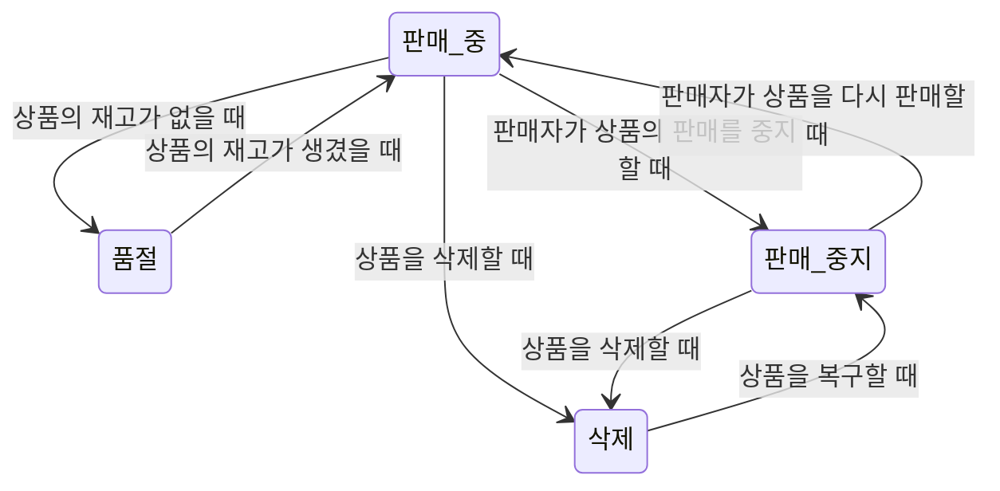
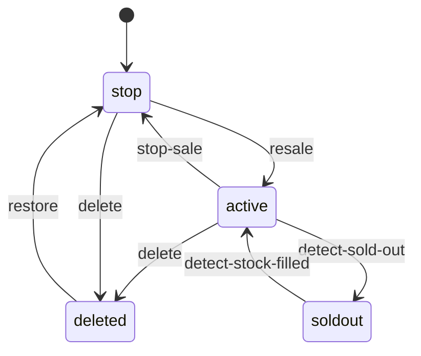

## 상태가 너무 많아!


업계에서 많이 일하다보면 정말 사소한 것 하나하나에도 상태가 있다는 것을 느끼게 된다.

예를 들어, 사용자의 로그인 상태, 주문 상태, 결제 상태 등등 많은 상태가 존재한다.

이러한 상태들은 일반적으로 코드나 DB에 저장되어 관리되며 상태에 따라 다른 로직을 수행하기 위해 사용한다.

## 전제
REST에서 핸들링하는 데이터 자체도 역시 Representational State Transfer의 약어로 상태와 관련된 것이지만, 해당 글에서 다루는 좀 더 협의의 상태를 다루게 될 것이다.

예를 들어 다음과 같은 JSON 레코드가 있다고 가정하면
```json
{
    "name": "John",
    "age": 30,
    "state": "active"
}
```

REST에서는 위 레코드 전체를 상태라고 간주하지만, 해당 글에서는 `state`와 같은 특정 필드를 상태라고 간주하고 설명한다.
> 물론 FSM에서도 해당 전체 레코드를 상태로 간주할 수 있지만 상태 개수에 따라 매우 많은 분기가 발생하기 적합하진 않다.

## 문제
일반적으로 상태를 관리할 때에는 `if-else` 문이나 `switch-case` 문을 사용하여 상태에 따라 다른 로직을 수행하도록 구현한다.

다만 상태가 많아지면 많아질수록 코드는 복잡해지고, 유지보수가 어려워진다.

필자의 경우 다양한 쇼핑 플랫폼에서 상품, 주문, 클레임 등의 다양한 리소스의 상태를 관리하다보니 해당 상품의 상태를 현재 서비스의 상태로 변환하는 것에서 많은 고민을 했었다.

필연적으로 단순 if-else 기반으로 상품의 상태를 작성하게 된다면 아래처럼 다소 코드가 복잡해질 수 있다.

```go
if product.State == "active" {
    if product.Stock == 0 {
        // 상품이 재고가 없을 때
        product.State = "soldout"
    }
	if action.Type == "stop" {
        // 상품 판매 중지
        product.State = "stop"
    }
    if action.Type == "delete" {
        // 상품 삭제
        product.State = "deleted"
    }
} else if product.State == "soldout" {
    if product.Stock > 0 {
        // 상품 재고가 생겼을 때
        product.State = "active"
    }
} else if product.State == "stop" {
    if action.Type == "resale" {
        // 상품 재판매
        product.State = "active"
    }
	if action.Type == "delete" {
        // 상품 삭제
        product.State = "deleted"
    }
} else if product.State == "deleted" {
    if action.Type == "restore" {
        // 상품 복구
        product.State = "stop"
    }
} ...
```
사실 내부의 코드가 별로 없어 큰 문제는 아니라 생각할 수 있지만, 만약 내부에 상태에 따라 다양한 로직을 수행해야 한다면, 코드는 급격히 복잡해질 것이다. 
> 개인적으로 지금 로직만 봐도 복잡하다고 느꼈다.

상태가 많은 것도 한몫한다. 코드 안에 있는 상태는 온전히 개발자가 기억으로 더듬거려야 하며, if문에 잘못해서 !을 빼먹는다던가, 상태를 잘못 비교한다던가 하는 문제로 휴먼에러는 언제든 발생할 수 있다.

요구사항에 따라서 이중 if문, 어떤 것은 3중 if문 등으로 상태를 처리하게 된다면, 더더욱 그에 대한 코드는 복잡하고, 관리에 대한 코스트는 높아질 수 밖에 없는 것이다.

## FSM(Finite State Machine): 유한 상태 기계
이제 이러한 상태를 좀 더 효율적으로 관리하기 위해 유한 상태 기계(FSM)에 대해 알아보자. 

유한 상태 기계란, 상태와 이벤트를 정의하고, 상태 전이를 정의하는 것이다. 일반적으로 게임 개발에서 많이 사용되는 개념이지만, 단순히 상태가 너무 많은 경우에서도 이를 도입하여 상태를 관리할 수 있다.

일반적인 구성 요소는 다음과 같다.


1. 상태(State): 상태를 정의한다.
2. 이벤트(Event): 상태 전이를 일으키는 이벤트를 정의한다. 
3. 상태 전이(Transition): 상태 전이를 정의한다.
4. 행동(Action): 상태 전이 시 수행할 로직을 정의한다.

심플한 개념이다. Event의 집합을 모아서 FSM이라고 보면 된다.

이를 좀 더 쉽게 이해하기 위해 위에 그렸던 if문을 다이어그램으로 표현하면 다음과 같다.

각각의 화살표의 시작과, 끝은 상태를 의미하며, 화살표는 액션을 의미한다.


기획을 할 때 종종 이런 상태 다이어그램을 받아보곤 하는데, 실제로 이를 코드로 옮긴 것을 FSM이라고 이해하면 쉽다.

## Go에서의 FSM
이를 구현하기 위해 많은 상태 관리 라이브러리가 있으나, 이번 포스팅에서는 [`looplab/fsm`](https://github.com/looplab/fsm) 라이브러리를 이용해 구현해볼 것이다.

### 설치
```shell
go get github.com/looplab/fsm
```


### 예제 
아까 구현했던 복잡한(?) if-else문을 FSM으로 구현해보자.
```go
	fsm := fsm.NewFSM(
    "active", // 초기 상태
    fsm.Events{
        {Name: "detect-sold-out", Src: []string{"active"}, Dst: "soldout"},
        {Name: "stop-sale", Src: []string{"active"}, Dst: "stop"},
        {Name: "delete", Src: []string{"active", "stop"}, Dst: "deleted"},
        {Name: "detect-stock-filled", Src: []string{"soldout"}, Dst: "active"},
        {Name: "resale", Src: []string{"stop"}, Dst: "active"},
        {Name: "restore", Src: []string{"deleted"}, Dst: "stop"},
    },
    fsm.Callbacks{
        "detect-sold-out": func(ctx context.Context, e *fsm.Event) {
            product, ok := e.Args[0].(Product)
            if !ok {
                e.Err = errors.New("invalid product")
                return
            }
    
            // 재고가 있으면 품절로 변경하지 않음
            if product.Stock > 0 {
                e.Dst = e.Src
                return
            }
        },
        "detect-stock-filled": func(ctx context.Context, e *fsm.Event) {
            product, ok := e.Args[0].(Product)
            if !ok {
                e.Err = errors.New("invalid product")
                return
            }
        
            // 재고가 없으면 판매중으로 변경하지 않음
            if product.Stock == 0 {
                e.Dst = e.Src
                return
            }
        },
    },
)
```
코드로 나타내면 다음과 같다.

```go
    fsm.Events{
        {Name: "detect-sold-out", Src: []string{"active"}, Dst: "soldout"},
        {Name: "stop-sale", Src: []string{"active"}, Dst: "stop"},
        {Name: "delete", Src: []string{"active", "stop"}, Dst: "deleted"},
        {Name: "detect-stock-filled", Src: []string{"soldout"}, Dst: "active"},
        {Name: "resale", Src: []string{"stop"}, Dst: "active"},
        {Name: "restore", Src: []string{"deleted"}, Dst: "stop"},
    },
```
먼저 이 부분은 이벤트를 정의하는 부분이다. `detect-sold-out`, `stop-sale`, `delete` 등의 이름을 가진 이벤트를 정의하고, 각 이벤트가 발생할 때의 상태 전이를 정의한다.
이 함수는 `fsm.Event(ctx, "{event_name}")`함수를 호출 할때 Src가 일치하는 경우, Dst로 FSM 내부 상태를 저절로 전이한다. 

```go
    fsm.Callbacks{
        "detect-sold-out": func(ctx context.Context, e *fsm.Event) {
            product, ok := e.Args[0].(Product)
            if !ok {
                e.Err = errors.New("invalid product")
                return
            }
    
            // 재고가 있으면 품절로 변경하지 않음
            if product.Stock > 0 {
                e.Dst = e.Src
                return
            }
        },
        "detect-stock-filled": func(ctx context.Context, e *fsm.Event) {
            product, ok := e.Args[0].(Product)
            if !ok {
                e.Err = errors.New("invalid product")
                return
            }
        
            // 재고가 없으면 판매중으로 변경하지 않음
            if product.Stock == 0 {
                e.Dst = e.Src
                return
            }
        },
    },
```
콜백은 각 이벤트가 호출 시 수행할 로직을 정의하는 부분이다. 기존 if-else에 명시된 로직 중 `resale`, `restore` 등의 이벤트는 단순히 상태만 변경하기 때문에 FSM 내부에서 변경하는 상태를 통해 처리하기로 해서 따로 콜백을 작성하지 않았다.
다만, `detect-sold-out`, `detect-stock-filled`의 경우에는 `product`의 리소스인 `Stock` 필드를 따로 참조하기 때문에, 추가적으로 `Argument`를 내부에서 전달하여 사용하도록 했다.

`e.Args`는 FSM에서 이벤트 호출 시 전달할 인자를 정의하는 것으로, `fsm.Event(ctx, "{event_name}", product)`와 같이 호출하면, 콜백 함수 내부에서 `e.Args[0]`으로 `product`를 참조할 수 있다.

이제 의도한 대로 동작하는지 테스트해보자 

```go
	ctx := context.Background()

	// 재고는 없으나, 판매중으로 되어 있는 상품의 경우
	product := Product{
		State: "active",
		Stock: 0,
	}

	// 재고가 있는지 확인 후 상태 변경
	if err := fsm.Event(ctx, "detect-sold-out", product); err != nil {
		log.Fatal(err)
	}
	product.State = fsm.Current()
	fmt.Printf("Product state: %s\n", product.State)

	// 판매자가 재고를 10개로 채웠음
	product.Stock = 10
	if err := fsm.Event(ctx, "detect-stock-filled", product); err != nil {
		log.Fatal(err)
	}
	product.State = fsm.Current()
	fmt.Printf("Product state: %s\n", product.State)

	// 판매자가 판매를 중지함
	if err := fsm.Event(ctx, "stop-sale"); err != nil {
		log.Fatal(err)
	}
	product.State = fsm.Current()
	fmt.Printf("Product state: %s\n", product.State)

	// 판매자가 상품을 다시 판매함
	if err := fsm.Event(ctx, "resale"); err != nil {
		log.Fatal(err)
	}
	product.State = fsm.Current()
	fmt.Printf("Product state: %s\n", product.State)

	// 판매자가 상품을 삭제함
	if err := fsm.Event(ctx, "delete"); err != nil {
		log.Fatal(err)
	}
	product.State = fsm.Current()
	fmt.Printf("Product state: %s\n", product.State)

	// 판매자가 삭제된 상품을 복구함
	if err := fsm.Event(ctx, "restore"); err != nil {
		log.Fatal(err)
	}
	product.State = fsm.Current()
	fmt.Printf("Product state: %s\n", product.State)
```

위 코드를 실행하면 다음과 같은 결과를 얻을 수 있다.

```shell
Product state: soldout
Product state: active
Product state: stop
Product state: active
Product state: deleted
Product state: stop
```
다음과 같이 액션에 따라 상태가 변경되는 것을 확인할 수 있다.

### 시각화
FSM은 시각화 기능을 제공한다. 해당 라이브러리 뿐만 아니라 FSM을 표방하는 많은 도구들이 Mermaid 등의 도구를 통해 적절히 시각화를 하는 것을 지원한다.

```go
	mermaid, err := fsm.VisualizeWithType(f, fsm.MERMAID)
    if err != nil {
        log.Fatal(err)
    }
    
    fmt.Println(mermaid)
```
위와 같이 `fsm.VisualizeWithType` 함수를 통해 시각화할 수 있으며, mermaid, graphviz 등의 다양한 형태로 시각화할 수 있다.

출력값은 다음과 같다. 
```shell
stateDiagram-v2
    [*] --> stop
    active --> deleted: delete
    active --> soldout: detect-sold-out
    active --> stop: stop-sale
    deleted --> stop: restore
    soldout --> active: detect-stock-filled
    stop --> deleted: delete
    stop --> active: resale
```

필자의 블로그는 `mermaid`를 지원하기에 이를 이용해 시각화한 결과는 다음과 같다.



꽤나 깔끔하게 시각화가 가능함을 알 수 있다.

이외에도 다양한 방식의 시각화가 가능하고, 필요에 따라서는 이를 이미지화 해서 특정 링크에 들어가면, 상태 값이 어떻게 변하는지 직접 눈으로 확인하게 만들 수도 있을 것이다.

## 마무리
사실 코드로 보았을 때 **FSM 자체가 코드량을 줄여준다거나 하는 도구임은 명확하게 아니다.**  오히려 FSM등을 초기화 하고, 적절한 예외처리를 위해서 코드량이 더 늘어날 수도 있다.
> 물론 보기 안좋다는 것은 아니다 지금은 main함수에 모조리 넣었지만, 실무에서는 콜백과 이벤트들을 적절히 분리하여 모듈화하고, 상태와 이벤트를 정의하는 부분을 따로 빼서 관리하게 될 것이다.

그럼에도 이를 사용하는 이유는 단순히 코드가 줄어듦을 방지하기 보다는 상태의 플로우와 관계를 명확하게 정의하고, 이를 시각화하여 관리하기 쉽게 만들어주기 때문이다.

방대한 if문을 명확한 `Src`와 `Dst` 정의를 통해 상태의 전이를 표현하고, 행동들을 `Callbacks`으로 정의하므로써 코드의 가독성과 유지보수성을 높이고, 상태가 많은 상태에서도 복잡도를 낮출 수 있다.

## Full Code
- [Github](https://github.com/YangTaeyoung/go-fsm-demo)

## Reference
- https://github.com/looplab/fsm
- https://ko.wikipedia.org/wiki/%EC%9C%A0%ED%95%9C_%EC%83%81%ED%83%9C_%EA%B8%B0%EA%B3%84