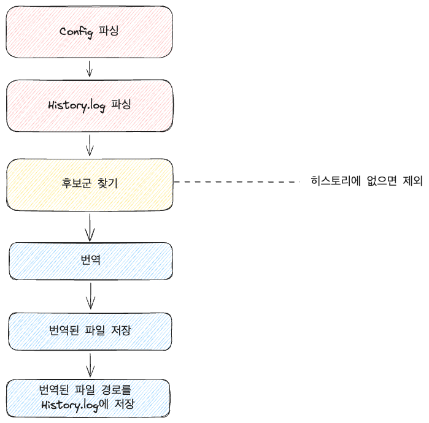
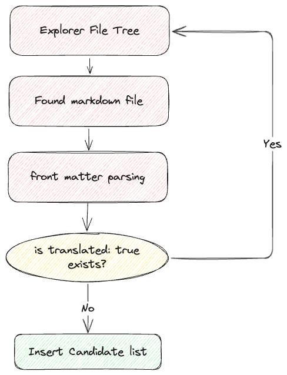
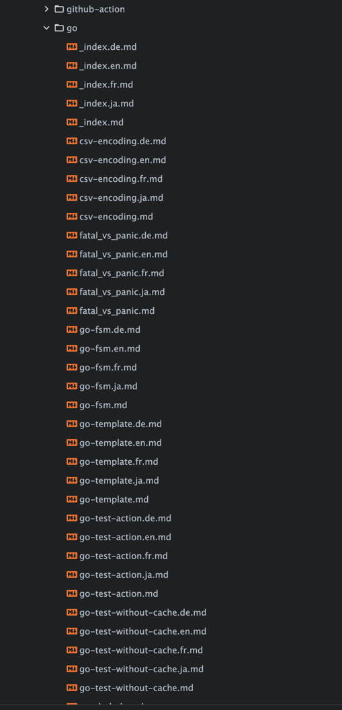

## Task

Recently, with the advancement of AI, I started using Gemini for work. Watching it handle unstructured data so well reminded me of the tearful tasks I once performed.

Putting that aside, there has always been something that felt like a homework assignment to me. That is translating my blog. I heard that translating would attract many more readers to the blog, and there was a time when I considered using the Google Translate API to give it a try, but I ended up leaving it alone due to my laziness.

With the quality of AI translation improving significantly, I decided to start a project to translate all my posts. Hence, this post will introduce the reasons why I decided to translate my blog, how the process went, and what features are included.


### CLI or Web Service?
Actually, at first, I intended to create it as a web service. The idea was to upload a folder and be able to download the translated files automatically.

However, maintaining a separate server and managing configurations felt like it had many drawbacks.

Ultimately, I chose the CLI route. It was convenient to implement in Golang (since I had experience with it already...) and it integrated easily with things like GitHub Actions, so there were many advantages to this choice.
> I should eventually release it through GitHub Actions too. (Although I'll probably have to upload the translations to an archive...)

## Starting the Translation Project
I named it somewhat arbitrarily. Since it is a service that translates blogs made with Hugo, I called it [`hugo-ai-translator`](https://github.com/YangTaeyoung/hugo-ai-translator). Looking back now, there's probably a more fitting name that embodies the spirit of Go... (Names like hugo-trans or transify come to mind, but I think the current name is clear enough.)
> If you have any name recommendations, please let me know... I'm open to suggestions.

First, I examined the folder structure of Hugo. 

Although not all folder structures are the same, most Hugo blogs start by placing `md` files within a folder called `content`.

This is the typical structure:

```
/content
    /some
        index.md
    _index.md
```

To support `multilingual`, it would transform into the following structure:
> In fact, this part varies by theme. I have only confirmed about two cases, so if your Hugo blog structure cannot be generalized under the rules described below, I hope you'll leave a comment.

### Case 1: Including Locale in the Filename
Some maintain the existing folder structure while including the locale in the filename. In this case, it has the following structure:

```
/content
    /some
        index.md
        index.ko.md
        index.en.md
    _index.md
    _index.ko.md
    _index.en.md
```
### Case 2: Separating Folders by Locale
There are also cases where folders are separated by locale. In this case, the structure would look like this:

```
/content
    /ko
        /some
            index.md
        _index.md
    /en
        /some
            index.md
        _index.md
```

## Establishing Rules
The prompt part was actually simpler than expected (~~"Just translate this into English" works~~), and the bigger challenge was how to carry out automated translations and how to save the automatically translated files according to rules.

First, I had to establish rules for the files that would be saved.

What is needed for the saved files?

I transformed the file tree structure into a path that would be easier to define rules.
### Case 1: Including Locale in the Filename
```
/content/some/index.md
/content/some/index.ko.md
/content/some/index.en.md
/content/_index.md
/content/_index.ko.md
/content/_index.en.md
```

### Case 2: Separating Folders by Locale
```
/content/ko/some/index.md
/content/en/some/index.md
/content/ko/_index.md
/content/en/_index.md
```

When laid out, patterns emerged regarding their composition.

1. All start under the /content folder.  → Thus, the /content folder path should be the reference.
2. A language code is present.  → like `ko`, `en`, etc.
3. The file name is present.  → like `index`, `_index`, etc.
4. Content → The path prior to the file name is included.  → like `/some`, etc.

Based on this, I summarized the necessary elements for the rules.
- {language}: Language code
- {fileName}: File name
- {origin}: The path from content to before the file name

Now, what I did was to define `target_path_rule` based on these rules.

I drafted it to feel like:
For case 1, it would look like:
```
{origin}/{fileName}.{language}.md --> /some/index.ko.md
```

For case 2, it would look like:
```
/{language}/{origin}/{fileName}.md --> /ko/some/index.md
```

## Re-translating Already Translated Files
When I succeeded the first time, it felt great, but when I attempted to translate for the second time, I found myself trying to translate files that were already translated.

I was merely targeting .md files, and I had no logic in place to filter out already translated files.

**How to filter out already translated files** became the biggest issue.

I could define it using ignore_rules, but specifying such rules every time I added a language would be a nightmare.

All I ever wanted was for translations to happen with a single click in the CLI.

### Try 1: Adding a History File
Instead of secretly, I considered creating a `history.log` to record already translated files and filter them out.

Initially, I would read the `history.log` when loading the Config and filter out any file in that list while parsing candidates.

Expressed in a diagram, it would look like this:



However, this method had two main problems:

1. When accessing from another computer, the `history.log` gets lost.
2. It’s inconvenient for the log file to interfere with the business logic.


### Try 2: Recording Translation Status in Front Matter
Markdown contains a concept called Front Matter. Most blog posts utilize these quite well.

For instance, it would look something like this:
```markdown
---
title: "Hello World"
date: 2025-03-06
--- 

# Hello World ~
Hello Everyone! my first post!
```

Here, title, date, etc., are Front Matter. It can be defined in toml, yaml, json, etc., but for blogging, yaml front matter is commonly preferred for ease of management.

The idea was to record the translation status in the front matter like this:
```markdown
---
title: "Hello World"
date: 2025-03-06
translated: true
---
```

This way, when reading files, I could filter them out based on whether the front matter indicated that they were translated, making it truly a simple click action.

Expressed in a diagram, it would look like this:



This method is much cleaner than using `history.log`, and since the translated files are managed in Git, I could filter out translated files even when accessing from another computer.

## Translation Quality Issues

While I resolved the issue of filtering out already translated files, I could not address the quality of the translated text.

Initially, when selecting the model, I thought gpt-3.5-turbo would be quite cheap, so I chose it. While it performed well for English translations, it struggled with languages like Japanese and Chinese.

I wondered if it was a prompt issue and tried adding phrases like:

**"Please translate it better, I'm begging you"**

But the results were the same.

At first, I thought about adding an AI servant that could check the quality by converting it to an agent ([see the discussion here](https://github.com/YangTaeyoung/hugo-ai-translator/issues/1)), but upgrading the model to `GPT-4o` solved the problem.
> I once heard that if I encountered unresolved issues, it might be a sign of not investing enough money, and it turned out to be true.

Ultimately, models as capable as gpt-4o-mini were also translating very adequately.

## The Issue of Code Blocks Being Wrapped
When translated into markdown, there was a bug where code block characters included in the output. For example: ` ```markdown ``` `

Initially, I would manually remove these.
```go
content := res.Choices[0].Message.Content
content = strings.Trim(content, " ")
content = strings.TrimPrefix(content, "```
")
content = strings.TrimPrefix(content, "```markdown\n")
content = strings.TrimSuffix(content, "\n")
content = strings.Trim(content, "```")
```

However, there were cases where they weren't entirely removed. After consulting friends, I learned that using schemas could standardize the format, so I applied this immediately and it resolved the issue.

I created a function to make the schema as follows:
```go
package translator

import "github.com/invopop/jsonschema"

type TranslateResponse struct {
    Markdown string `json:"markdown" jsonschema_description:"translated result"}`
}

func GenerateSchema[T any]() interface{} {
    reflector := jsonschema.Reflector{
        AllowAdditionalProperties: false,
        DoNotReference:            true,
    }
    var v T
    schema := reflector.Reflect(v)
    return schema
}

var TranslateMarkdownSchema = GenerateSchema[TranslateResponse]
```

Then it can be invoked like this:
```go
schemaParam := openai.ResponseFormatJSONSchemaJSONSchemaParam{
    Name:        openai.F("markdown"),
    Description: openai.F("translated markdown"),
    Schema:      openai.F(TranslateMarkdownSchema()),
    Strict:      openai.Bool(true),
}

res, err = t.client.Chat.Completions.New(gctx, openai.ChatCompletionNewParams{
    // ...
    ResponseFormat: openai.F[openai.ChatCompletionNewParamsResponseFormatUnion](
        openai.ResponseFormatJSONSchemaParam{
            Type:       openai.F(openai.ResponseFormatJSONSchemaTypeJSONSchema),
            JSONSchema: openai.F(schemaParam), // Here
        }),
    Model: openai.F(t.cfg.Model),
})
```

## How to Use

The journey has been long.

Actually, I considered writing a detailed usage guide, but here I will quickly convey the essentials, and for a detailed usage guide, it would be good to refer to [the README.md in the Repository](https://github.com/YangTaeyoung/hugo-ai-translator).

In conclusion, my lengthy `.md` files blossomed into a beautifully structured elegant file tree as shown below:




### Quick Start
The configuration file is saved at `~/.hugo-ai-translator/config.yaml`.

```yaml
openai:
    model: gpt-4o-mini
    api_key: {your-openai-api-key}
translator:
    content_dir: {content-dir-path} # ex. ~/dev/personal/YangTaeyoung.github.io/content
    source:
        source_language: ko
        ignore_rules: []
    target:
        target_languages:
            - en
            - ja
            - fr
            - de
        target_path_rule: '{origin}/{fileName}.{language}.md'
```

If someone thinks, "Do I really need to know this structure?" I have also set a command to configure it like the AWS CLI.

Set it up nicely with the following command:
```shell
hugo-ai-translator configure
```

If the file rules are the same as mine ([for Case 1](#case-1-including-locale-in-the-filename)), just replace `{your-openai-api-key}` with your own OpenAI API key and set the `content_dir`, and you’ll be ready to go.

### Click!
Once you have completed the configuration file, just click:
```shell
hugo-ai-translator
```


## Remaining Tasks
This project is not finished yet.  

### 1. Performance Issues

When running translations, it becomes very sluggish. Initially, I set it to run all in Goroutines but kept exceeding the OpenAI API's Rate Limit, so now, Goroutines are allocated only per unit of language being translated together.

[Currently, I'm considering using worker pools or the rate package to directly manage the Rate Limit.](https://github.com/YangTaeyoung/hugo-ai-translator/issues/13) (retrier could also be a solution)

### 2. [Case 2](#case-2-separating-folders-by-locale) Not yet included
In fact, Case 2 has yet to be included. The reason is that the source language is included in the path, and the current implementation assumes cases where the source language is not included in the path.

It’s also difficult to make the rule assume that it recognizes the source language if the code appears somewhere in between.

Currently, I plan to create a path using the target-path-rule with the source language code and treat any files found in that path as original.

### 3. Copying Static Files
This is also a Case 2 issue, where if the folders are different, there may be cases where static files are not copied.

For instance:
```
/static
    /ko
        /some
            index.md
            image.png
```

In cases like this, even if the md file is translated and saved according to the rules, the image files may not be moved.

To address this, I am considering adding an option called `static_copy` that allows users to choose whether to copy static files.

## References
- [OpenAI](https://openai.com)
- [Open AI Models](https://platform.openai.com/docs/models)