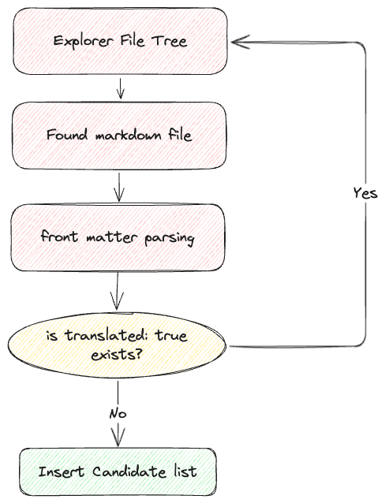
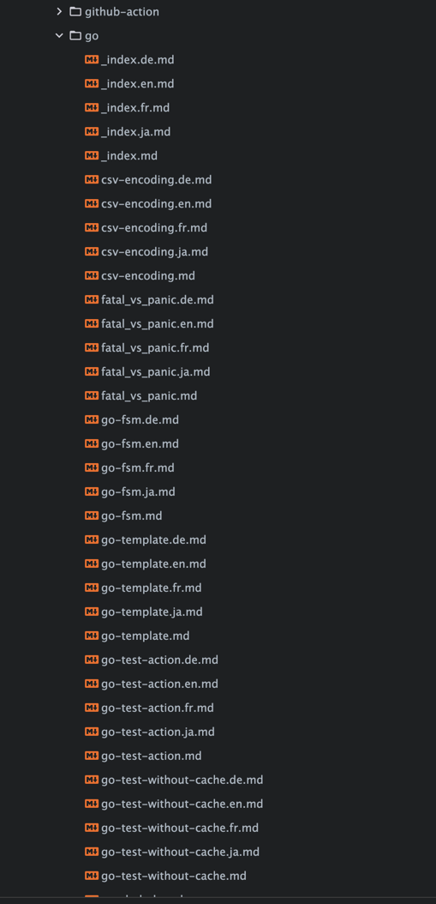

## 課題

最近AIが発展し、業務にGeminiを利用するようになった。非定型データをこんなにも上手く扱う様子を見て、以前行っていた涙ぐましい作業が頭に浮かんできた。

さて、本題に入るが、昔から宿題のように感じていたことがある。それはブログの翻訳だ。過去に翻訳をするとブログを見る人が大幅に増えるという話を聞いたことがあり、以前はGoogle Translate APIを使って翻訳を試みようと思ったが、怠け心に負けてそのまま放置していた。

AI翻訳の分野もクオリティが非常に良くなってきたので、今回の機会に全ての投稿を翻訳してみるプロジェクトを始めることにした。そこで、この投稿では私がブログを翻訳することになった経緯、進め方、どのような機能があるのかを紹介したい。


### CLIかWebサービスか
実は最初はWebサービスで作ろうと思っていた。フォルダをアップロードすると、自動的に翻訳されたファイルをダウンロードできるようにするものであった。

別途サーバーを維持する必要があり、設定なども別途管理しなければならないことが多く、欠点が多かった。

結局CLIを選択したのだが、Golangで実装したときにCLIが便利であったし（すでに多くの実装経験があるため...）、Github Actionsなどでも統合しやすいので、色々と有利な点が多かった。
> 後にはGithub Actionsでもリリースしなければならないな。(翻訳版はアーカイブに上げる必要があるかもしれないが...)


## 翻訳プロジェクトの開始
名前は適当に付けた。Hugoで作られたブログを翻訳するサービスなので、[`hugo-ai-translator`](https://github.com/YangTaeyoung/hugo-ai-translator)と名付けたが、今思うともっとGoらしい良い名前があったのではないかと思う...(hugo-trans、transifyなど、色々なネーミングが頭に浮かぶが、今のところは明確だと思う)
> もしおすすめの名前があれば教えてほしい...いつでも受け入れています

まずはHugoのフォルダ構造を見てみた。

全てのフォルダ構造が同じわけではないが、ほとんどのHugoブログは`content`というフォルダの中に`md`ファイルを入れるところから始まる。

ほとんどがこのような構造をしている。  
```
/content
    /some
        index.md
    _index.md
```

これに`multilingual`をサポートするには、次のようなフォルダ構造に変わる。
> 実際、この部分はテーマごとに異なる。私が確認したケースは2つほどで、自分のHugoブログの構造が以下に説明するルールに含まれない場合はコメントを残してほしい。  

### ケース1. ファイル名にLocaleを含む場合
既存のフォルダ構造を維持しつつ、ファイル名にLocaleを含む場合がある。この場合には次のような構造になる。
```
/content
    /some
        index.md
        index.ko.md
        index.en.md
    _index.md
    _index.ko.md
    _index.en.md
```
### ケース2. フォルダをLocaleで区別する場合
フォルダをLocaleで区別する場合もある。この場合には次のような構造になる。
```
/content
    /ko
        /some
            index.md
        _index.md
    /en
        /some
            index.md
        _index.md
```

## ルールを定める
思ったよりもプロンプト部分は簡単で（~~"これを英語に翻訳して"と言えば良いのだが~~）、より難しいのは自動翻訳をどのように行い、自動翻訳されたファイルをどのようにルールに従って保存するかだった。

まずは保存されるファイルのルールを定めなければならなかった。

保存されるファイルには何が必要だろうか？

さっきファイルツリー構造をルールにうまく変換してみた。  
### ケース1. ファイル名にLocaleを含む場合  
```
/content/some/index.md
/content/some/index.ko.md
/content/some/index.en.md
/content/_index.md
/content/_index.ko.md
/content/_index.en.md
```

### ケース2. フォルダをLocaleで区別する場合  
```
/content/ko/some/index.md
/content/en/some/index.md
/content/ko/_index.md
/content/en/_index.md
```

並べてみると、どの要素で構成されているのか規則性が見えた。

1. すべて/contentフォルダの下から始まる。->つまり/contentフォルダのパスが基準となるべきである。
2. language codeが入る。->`ko`、`en`など
3. ファイル名が入る。->`index`、`_index`など
4. content -> ファイル名の前までのパスが入る。->`/some`など

これを基にルールに必要な要素を整理した。  
- {language}: 言語コード  
- {fileName}: ファイル名  
- {origin}: contentからファイル名の前までのパス  

今私がやったのはこのルールを基に`target_path_rule`を定義することだった。

大体こういう感じで定義した。
ケース1では次のようになり、  
```
{origin}/{fileName}.{language}.md --> /some/index.ko.md
```

ケース2では次のようになる。  
```
/{language}/{origin}/{fileName}.md --> /ko/some/index.md
```

## すでに翻訳されたファイルを再翻訳する問題
最初に成功したときは素晴らしい快感を感じたが、二度目の翻訳を試みると、すでに翻訳されたファイルを再度翻訳しようとしてしまった。

私は単純に.mdファイルをターゲットにしただけで、すでに翻訳されたファイルをフィルタリングするロジックはなかった。

**すでに翻訳されたファイルをどのようにフィルタリングするか**が最大の問題だった。

ignore_rulesで定義してフィルタリングすることもできるが、言語を追加するたびにこれらのルールを指定しなければならないのはまさに地獄だ。

私は単にCLIを一度クリックするだけで翻訳ができることを望んでいただけだ。

### Try 1. 履歴ファイルを追加  
ユーザーに隠れて（？）`history.log`というものを作成し、すでに翻訳されたファイルを記録してそれをフィルタリングする方法を最初に考えた。

初期にConfigをロードする際に`history.log`を読み込んでリスト化し、候補群をパースする際、このリストにあるファイルをフィルタリングする方式だった。

図で表現すると次のようになる。


しかし、この方法には二つの問題があった。

1. 他のコンピュータに接続すると`history.log`が見つからなくなる。  
2. ログファイルがビジネスロジックに関わっているのが不便だ。


### Try 2. Front matterに翻訳状況を記録する  
マークダウンにはFront matterという概念がある。大多数のブログ投稿はこのようなものを上手に活用している。

例えば、こんな感じである。  
```markdown
---
title: "Hello World"
date: 2025-03-06
--- 

# Hello World ~
Hello Everyone! my first post!
```

ここでのtitle、dateなどがFront matterである。toml、yaml、jsonなどで定義できるが、ブログ関連では通常yaml front matterが管理しやすくて、より多く使われている。  
アイデアはfront matterに次のように翻訳状況を記録することであった。  
```markdown
---
title: "Hello World"
date: 2025-03-06
translated: true
---
```

こうすれば、ファイルを読むときにfront matterを読み取って、translatedがtrueのファイルだけをフィルタリングできるので、まさにクリック一つできることになる。

図で表現すると次のようになる。  

  
この方法は`history.log`を使用する方法よりも遥かにシンプルで、翻訳されたファイルもGitで管理されるため、他のコンピュータに接続しても翻訳されたファイルをフィルタリングできるというメリットがあった。

## 翻訳品質の問題

すでに翻訳されたファイルをフィルタリングする問題は解決したものの、翻訳品質の問題は解決できなかった。

最初はモデルを選ぶ際にgpt-3.5-turboが安価だろうと考えてgpt-3.5-turboを選んだが、英語の翻訳はかなり良かったが、ja、cnなどの言語はほとんど翻訳できなかった。

プロンプトが問題かと思い、次のように文言を追加してみたが、  

**"もっと良く翻訳してくれ、お願い"**  
結果は同じだった。

最初は[AIをエージェント化して次のように品質をチェックするAI奴隷を追加しようかと思ったが](https://github.com/YangTaeyoung/hugo-ai-translator/issues/1)、モデルを`GPT-4o`に上げたら解決された。
> 昔、問題が解決されないなら、入ったお金が十分ではないかと考えてみるように言われたことがあったが、それは正しい。  
結論としてはgpt-4o-mini程度でも十分にうまく翻訳できた。

## コードブロックに包まれる問題

マークダウンで翻訳される過程で、出力にコードブロックの文字が含まれるバグがあった。  
ex ) ` ```markdown ``` `  
最初はこれを手動で取り除いていた。  
```go  
content := res.Choices[0].Message.Content  
content = strings.Trim(content, " ")  
content = strings.TrimPrefix(content, "```
")  
content = strings.TrimPrefix(content, "```markdown\n")  
content = strings.TrimSuffix(content, "\n")  
content = strings.Trim(content, "```")  
```  
しかし、完全に取り除かれないケースもあり、周りの知人に聞いてみると、そのような場合にはスキーマを使用することでフォーマットを一定に整えることができると言われたので、すぐに適用してみたら解決された。  
以下のようにスキーマを作成する関数を書いて、  
```go
package translator

import "github.com/invopop/jsonschema"

type TranslateResponse struct {
	Markdown string `json:"markdown" jsonschema_description:"translated result"}`
}

func GenerateSchema[T any]() interface{} {
	reflector := jsonschema.Reflector{
		AllowAdditionalProperties: false,
		DoNotReference:            true,
	}
	var v T
	schema := reflector.Reflect(v)
	return schema
}

var TranslateMarkdownSchema = GenerateSchema[TranslateResponse]
```  
次のように呼び出せば良い。  
```go
schemaParam := openai.ResponseFormatJSONSchemaJSONSchemaParam{
    Name:        openai.F("markdown"),
    Description: openai.F("translated markdown"),
    Schema:      openai.F(TranslateMarkdownSchema()),
    Strict:      openai.Bool(true),
}

res, err = t.client.Chat.Completions.New(gctx, openai.ChatCompletionNewParams{
    // ...
    ResponseFormat: openai.F[openai.ChatCompletionNewParamsResponseFormatUnion](
        openai.ResponseFormatJSONSchemaParam{
            Type:       openai.F(openai.ResponseFormatJSONSchemaTypeJSONSchema),
            JSONSchema: openai.F(schemaParam), // ここ
        }),
    Model: openai.F(t.cfg.Model),
})
```

## 使い方

紆余曲折が長かった。  
実際、使い方を長々と書くべきかとも思ったが、ここでは核心を素早く伝え、詳しい使い方は[RepositoryのREADME.md](https://github.com/YangTaeyoung/hugo-ai-translator)を参考にすると良いと思う。  
結論としては、私の長ったらしい.mdファイルが非常にすっきりと次のように優雅なファイルツリーで表れた。  




### クイックスタート
設定ファイルは`~/.hugo-ai-translator/config.yaml`に保存されている。  
```yaml
openai:
    model: gpt-4o-mini
    api_key: {your-openai-api-key}
translator:
    content_dir: {content-dir-path} # 例: ~/dev/personal/YangTaeyoung.github.io/content
    source:
        source_language: ko
        ignore_rules: []
    target:
        target_languages:
            - en
            - ja
            - fr
            - de
        target_path_rule: '{origin}/{fileName}.{language}.md'
```
この構造を知る必要がある？と思う人に対して、まるでAWS CLIのようにconfigureするコマンドも指定しておいた。  
次のような方法でさっぱりと設定しよう。  
```shell
hugo-ai-translator configure
```

私とファイル規則が同じであれば（[ケース1の場合](#case-1-ファイル名に-localeを-含む場合)）、`{your-openai-api-key}`を自分のOpenAI APIキーに変更し、`content_dir`だけ設定すればすぐに実行可能である。

### クリック！  
設定ファイルが完成したらクリックしてみよう。  
```shell
hugo-ai-translator
```


## 残された課題
まだこのプロジェクトは終わっていない。

### 1. 性能の問題

翻訳を回すと非常に遅くなってしまうが、最初は全部Goroutineで実行するようにしていたらOpenAI APIのRate Limitを超えてしまったので、現在は一緒に翻訳される言語単位でのみGoroutineを割り当てている。

[現在はworkerpoolを利用するか、rateパッケージを通じてRate Limitを直接管理することを考えている。](https://github.com/YangTaeyoung/hugo-ai-translator/issues/13) (retrierも方法になるだろう)

### 2. [ケース2](#ケース2-フォルダをlocaleで区別する場合)の補足
実際、ケース2はまだ含まれていない。理由はSource言語がパスに含まれているためで、現在の実装はSource言語がパスに含まれていない場合を想定しているからだ。

単にルールの前にsource language codeがあれば元のファイルとして認識するというのも困難で、中間に挟まることがあるからだ。  
現在はtarget-path-ruleを使ってソース言語のパスをあらかじめ作成し、翻訳候補ファイルを導出する際に、該当ファイルパスに含まれる場合は元のファイルとして認識しようとしている。

### 3. Staticファイルのコピー
これもケース2の問題であり、フォルダが異なる場合、Staticファイルもコピーされる場合がある。

例えば  
```
/static
    /ko
        /some
            index.md
            image.png
```

次のような構造でファイルがある場合等である。この場合、mdを翻訳してルールに従って保存しても、画像ファイルは移動されない。

これに対処するため、staticファイルもコピーするかどうかを選択する`static_copy`というオプションを追加する予定である。

## 参考
- [OpenAI](https://openai.com)  
- [Open AI Models](https://platform.openai.com/docs/models)  
