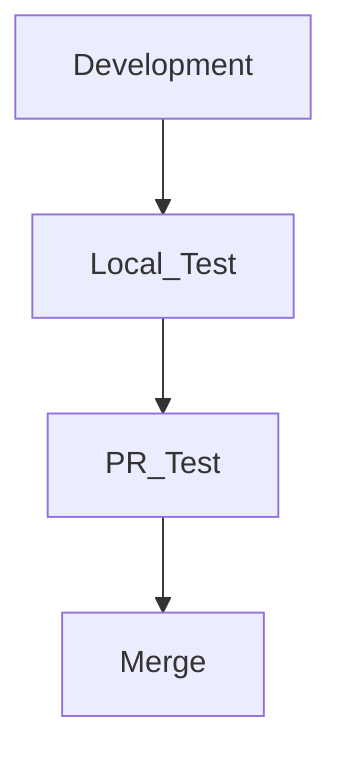

Wenn man an Server- oder allgemeiner Softwareentwicklung arbeitet, kommt man häufig dazu, Testcodes auszuführen.

In einer Zusammenarbeit kann man Tests eventuell mit CI/CD über Github Actions durchführen, und bei der lokalen Entwicklung kann man die Tests direkt ausführen.

In unser Firma haben wir normalerweise die folgende Reihenfolge für die Entwicklung verwendet:

Das Problem ist, dass man oft das lokale Testen vergisst und einen PR erstellt, wodurch die Tests in PR fehlschlagen.

Es ist zwar nicht besonders schlimm, da man einfach den Push erneut durchführen kann, aber ich möchte eine Funktion des JetBrains IDE vorstellen, die solche Fehler im Voraus verhindert.

## Testeinrichtung
Um Tests vor einem Commit zu konfigurieren, müssen Tests in der Ausführungskonfiguration hinzugefügt werden.

Zuerst klickt man neben dem oberen Play-Button auf `Edit Configurations`.

> Da ich die Programmiersprache Go benutze, füge ich einen Go Test hinzu, aber auch andere IDEs haben Test-bezogene Aktionen, die jederzeit hinzugefügt werden können.

Klickt auf die `+`-Schaltfläche und wählt `Go Test` aus.

Ich habe in der Standardkonfiguration nichts verändert und einfach auf `Apply` - `OK` geklickt, um die Einstellungen abzuschließen.  
> Wenn es spezielle Konfigurationen oder Einstellungen gibt, die man verwendet, kann man diese hinzufügen und anwenden.

### +ɑ) Beispiel Java

## Tests vor dem Commit ausführen

Zuerst setzt man in `Settings` - `Version Control` - `Commit` ein Häkchen bei `Run Tests`.

Dann wählt man im Dropdown-Menü `Choose configuration` den gerade hinzugefügten Test aus.

Damit kann man die Tests vor dem Commit ausführen.

Wenn man einen Commit mit den Tests durchführt, sieht man, dass die Tests wie folgt laufen:

