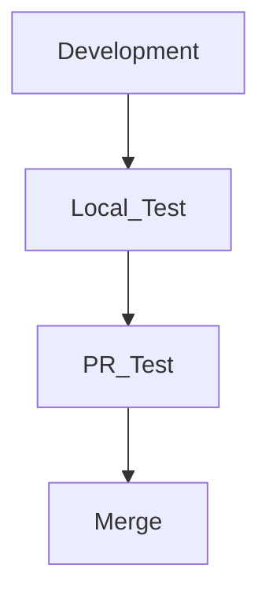

When developing server-side or general software, it is common to run test codes.

In a collaborative environment, tests can be conducted using CI/CD via GitHub Actions, and if you're developing locally, you might run the tests directly.

Typically, in our company, we followed a sequence like the one below:

The problem arises when we often forget to run local tests before submitting a PR, leading to failing tests in the PR.

While it’s not a huge issue since we can just fix it and push again, I’d like to introduce a feature in JetBrains IDE that helps prevent such mistakes.

## Setting Up Tests
To set up tests before a commit, the execution configuration must have the tests added.

First, click next to the play button at the top and select `Edit Configurations`.

> Since I am using Go, I will add Go Test, but other IDEs also have test-related actions that can be added anytime.

Click the `+` button and select `Go Test`.

I didn't change anything in the default configuration and simply clicked `Apply` - `OK` to complete the setup.  
> If you have other configurations or settings, you can add and apply them as needed.

### +a) Java Example

## Running Tests Before Commit

First, check `Run Tests` under `Settings` - `Version Control` - `Commit`.

Then, in the Choose configuration dropdown, select the test you just added.

This will ensure that tests are run before committing.

If you make a commit with tests, you'll see that the tests run as shown below.

