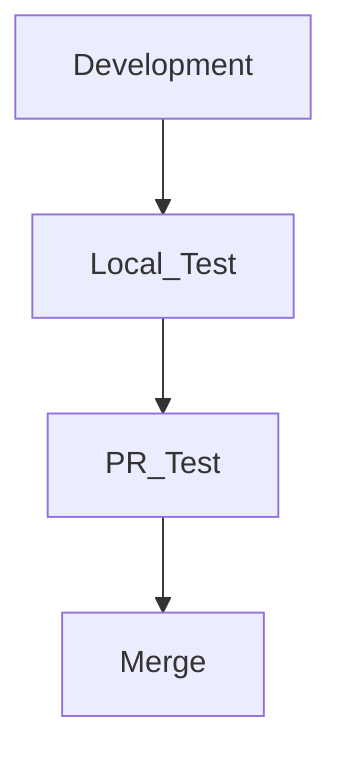

Lorsque l'on développe des logiciels pour des serveurs ou des applications en général, il est fréquent d'exécuter des tests.

Dans un contexte de collaboration, il est possible de réaliser des tests via CI/CD utilisant Github Actions, ou de lancer les tests directement lors du développement local.

En entreprise, le processus de développement suit généralement l'ordre suivant :

Le problème survient lorsque l'on oublie souvent les tests locaux et que l'on soumet une PR, ce qui peut entraîner des échecs de test dans la PR.

Bien qu'il s'agisse d'une simple correction à pousser, je vais vous présenter une fonctionnalité de l'IDE JetBrains pour éviter ce genre d'erreurs à l'avance.

## Configuration des tests
Pour configurer les tests avant de valider, il faut s'assurer que le test est ajouté dans la configuration d'exécution.

Tout d'abord, cliquez à côté du bouton de lecture en haut pour sélectionner `Edit Configurations`.

> J'utilise le langage Go, donc j'ajoute Go Test, mais d'autres IDE ont également des actions liées aux tests, donc il est toujours possible d'en ajouter.

Cliquez sur le bouton `+` et sélectionnez `Go Test`.

Je n'ai pas besoin de modifier la configuration par défaut et j'ai directement cliqué sur `Apply` - `OK` pour terminer la configuration.  
> Si vous avez des configurations ou paramètres spécifiques, vous pouvez les ajouter et les appliquer.

### +ɑ) Exemple en Java

## Exécuter les tests avant de valider

Tout d'abord, cochez `Run Tests` dans `Settings` - `Version Control` - `Commit`.

Ensuite, dans Choose configuration, sélectionnez le test que vous venez d'ajouter.

Ainsi, vous pourrez exécuter des tests avant de valider.

Si vous effectuez un commit avec des tests, vous pourrez voir que les tests s'exécutent comme ci-dessous.

