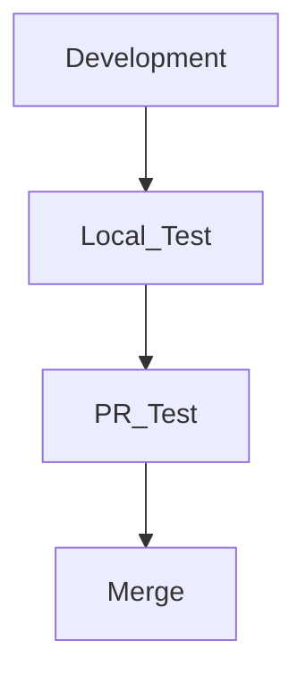

サーバーや一般的なソフトウェア開発を行っていると、テストコードを実行することが多くあります。

協業の状況では、Github Actionsを利用したCI/CDでテストを行うこともあれば、ローカル開発であれば直接テストを実行することもあります。

会社では一般的に次のような順序で開発を行っていましたが

問題はローカルテストをしばしば忘れてPRを上げ、PRでテストが壊れる場合です。

実際には修正してPushすれば済むことなので、それほど大したことではありませんが、こうしたミスを未然に防ぐためにJetBrains IDEの機能を紹介したいと思います。

## テストのセットアップ
コミット前にテストを構成するためには、実行構成にテストが追加されている必要があります。

まず、上部の再生ボタンの隣をクリックし、`Edit Configurations`をクリックします。

> 私はGo言語を使用しているためGo Testを追加しますが、他のIDEでもテストに関するアクションがあるのでいつでも追加可能です。 

`+`ボタンを押して`Go Test`を選択します。

私は基本構成を特に変更せずにそのまま`Apply` - `OK`を押して設定を完了しました。  
> 特に使用する構成や設定がある場合は追加して適用すれば良いです。

### +ɑ) Javaの例

## コミット前にテストを実行する

まず`Settings` - `Version Control` - `Commit`で`Run Tests`にチェックを入れます。

次にChoose configurationで先ほど追加したテストを選択します。

こうすることでコミット前にテストを実行させることができます。 

テストでコミットを一つ行ってみると、下のようにテストが実行されるのを確認できます。

