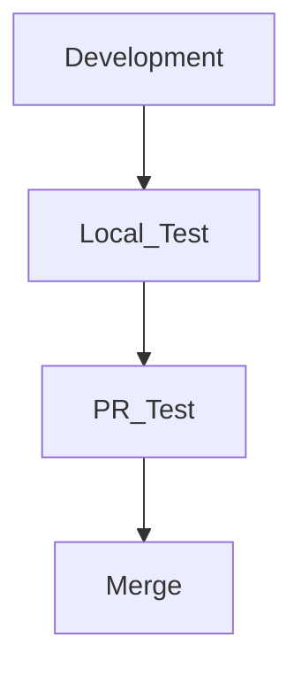

서버나 일반 소프트웨어 개발을 하다보면 테스트 코드를 실행하는 것이 많다.

협업을 하는 상황에서는 Github Actions를 이용한 CI/CD로 테스트를 할 수도 있고, 로컬 개발이라면 직접 테스트를 실행할 수도 있다.

회사에서는 일반적으로는 다음과 같은 서순으로 개발하곤 했는데

문제는 로컬 테스트를 종종 잊고 PR을 올려 PR에서 테스트가 깨지는 경우이다.

사실 고쳐서 Push 하면 되는 일이라 별로 큰 일은 아니지만, 이런 실수를 미연에 방지하는 JetBrains IDE의 기능을 소개하려고 한다.

## 테스트 셋업하기
테스트를 커밋 전에 구성하기 위해서는 실행 구성에 테스트가 추가되어 있어야 한다.

먼저 상단의 재생버튼 옆을 클릭하여 `Edit Configurations`을 클릭한다.

> 필자는 Go 언어를 사용하고 있기에 Go Test를 추가하지만, 다른 IDE라도 테스트 관련된 액션이 있으니 언제든 추가할 수 있다. 

`+` 버튼을 누르고 `Go Test`를 선택한다.

필자는 기본 구성에서 따로 건들건 없고 바로 `Apply` - `OK`를 눌러 설정을 완료했다. 
> 따로 사용하는 구성이나 설정이 있다면 추가하고 적용하면 된다.

### +ɑ) 자바 예시

## 커밋 전에 테스트 실행하기

먼저 `Settings` - `Version Control` - `Commit` 에서 `Run Tests`를 체크한다.

그리고 Choose configuration에서 방금 추가한 테스트를 선택한다.

이렇게하면 커밋 전에 테스트를 실행하게 할 수 있다. 

테스트로 커밋을 하나 해보면 아래와 같이 테스트가 돌아가는 것을 알 수 있다.

