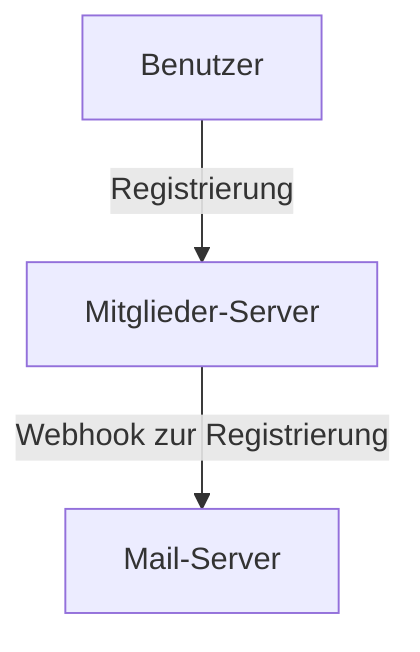

## Was ist ein Webhook?
Allgemein werden Anfragen vom Client an den Server gesendet, und der Server antwortet dem Client. (Anfrage-Antwort-Struktur)

In der Regel werden Webhooks genutzt, um regelmäßig stattfindende Benutzeraktionen zu melden. Wenn zum Beispiel ein Benutzersystem und ein Benachrichtigungssystem in einer MSA-Struktur (Microservices Architecture) getrennt sind, dann ist ein Beispiel dafür, wenn ein Benutzer sich auf einer Website anmeldet und eine E-Mail über die Registrierung geschickt wird.



Es handelt sich eigentlich nicht um eine besonders komplexe Funktion, die auch nicht grundlegend von normalen Anfragen abweicht. Man kann sich einfach merken, dass der Server eine Anfrage an einen bestimmten Server oder Client sendet, wenn ein bestimmtes Ereignis eintritt.

## Webhook testen
Wie kann man also einen Webhook testen?

### 1. Auf die Vollendung warten
Wenn es einen Mitglieder-Server und einen Mail-Server gibt, kann man die komplette Implementierung abwarten, um sich anzumelden. Das wäre sehr einfach.

Der Nachteil hierbei ist, dass, falls das Team aus mehreren Personen besteht, jeder die Funktionen der Server implementieren muss, wodurch die Tests für den Webhook auf alle Implementierungen warten müssen.

### 2. Dummy-Server implementieren
Alternativ kann man auch einen Dummy-Server selbst implementieren.

Da der Zweck darin besteht, Anfragen zu empfangen, kann man einen Server mit einem bestimmten Endpunkt (angenommener Mail-Server) erstellen und lediglich bei erfolgreicher Registrierung eine Anfrage senden.

Zum Beispiel könnte das so aussehen:
```go
package main

import (
    "fmt"
    "net/http"
)

func main () {
    http.HandleFunc("/webhook", func(w http.ResponseWriter, r *http.Request) {
        fmt.Fprintln(w, "Webhook empfangen!")
    })

    http.ListenAndServe(":8080", nil)
}
```

So könnte man einen Server implementieren und bei der Registrierung eine Anfrage an `/webhook` senden.

Diese Methode wird jedoch nicht wirklich empfohlen, da es ehrlich gesagt mühsam ist, und bei jeder neuen Funktion müssen jeweils geeignete Endpunkte hinzugefügt werden.

### 3. webhook.site verwenden
In solchen Fällen gibt es eine Website, die man verwenden kann: [webhook.site](https://webhook.site).

Diese Website empfängt Anfragen und bietet die Möglichkeit zu sehen, wie die Antwort auf diese Anfragen war.

Man kann sich das wie einen Dummy-Server vorstellen, der alle Anfragen empfängt.

Wie der Name [webhook.site](https://webhook.site) schon sagt, wurde die Seite grundsätzlich zum Testen von Webhook-Funktionen erstellt.

Wenn man die Seite besucht, wird standardmäßig eine Webhook-URL generiert, die nur von einem selbst verwendet werden kann, unter dem Abschnitt `Your unique URL`.


Jetzt kann man eine Anfrage an diese URL senden. In meinem Fall habe ich eine Anfrage über curl gesendet.

```bash
curl -X POST https://webhook.site/f5fcf7e6-2233-4374-8c73-32195b38e7fb -H "Content-Type: application/json" -d '{"name":"test"}'
```

Dann kann ich sehen, welche Anfragen eingegangen sind, welche Body-Daten gesendet wurden, welche Header vorhanden waren usw. All diese Informationen über die Anfrage sind einsehbar.


