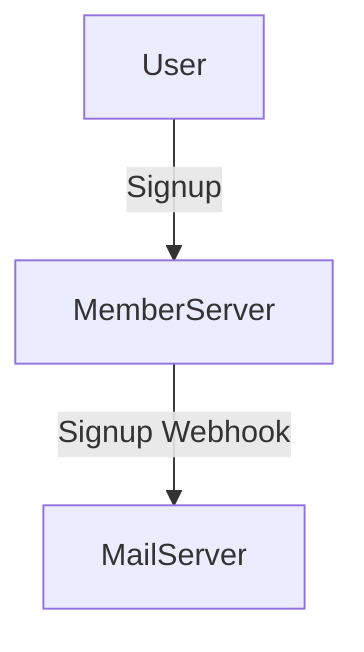

## What is a Webhook?
Typically, requests are sent from a client to a server, and the server responds back to the client. (Request-Response structure)

Webhooks are generally used to notify of user actions that occur irregularly, such as when a user signs up on a website in a microservices architecture where notification and user management servers are separated, which triggers a signup confirmation email.



In reality, it's not a very large function; it's not much different from a typical request. You just need to know that when a specific event occurs on the server, it sends a request to a particular server or client.

## How to Test Webhooks
So, how can we test webhooks?

### 1. Wait for Completion
For example, if you have both a member server and a mail server, you can easily test by implementing everything and trying a signup.

However, a downside is that if there are multiple team members, each implementing the server functionalities, you will have to wait for the implementation of all functions to test a single webhook.

### 2. Implement a Dummy Server
Alternatively, you could implement a dummy server yourself.

Since the goal is to receive requests, you can create a server with a specific endpoint (assuming a mail server) that only needs to send a request upon a successful signup.

It could look something like this:
```go
package main

import (
    "fmt"
    "net/http"
)

func main () {
    http.HandleFunc("/webhook", func(w http.ResponseWriter, r *http.Request) {
        fmt.Fprintln(w, "Webhook received!")
    })

    http.ListenAndServe(":8080", nil)
}
```

You would implement the server this way and send a request to `/webhook` upon registration.

However, this method is not particularly recommended since it can be cumbersome to create, and every time a new function is required, you need to add a corresponding endpoint.

### 3. Use webhook.site
There is a site that you can use in such cases, which is [webhook.site](https://webhook.site).

This site receives requests and allows you to verify how the response was received.

You can think of it as a dummy server that receives all requests. 

Since it's named [webhook.site](https://webhook.site), it was inherently created to test webhook functionalities.

Upon visiting the site, a webhook URL unique to you is generated in the `Your unique URL` section.


Now, you just need to send requests to that URL. In my case, I sent a request using curl:

```bash
curl -X POST https://webhook.site/f5fcf7e6-2233-4374-8c73-32195b38e7fb -H "Content-Type: application/json" -d '{"name":"test"}'
```

Then you can see all the details about the request, including what request came in, what the body contained, what headers were included, etc.


