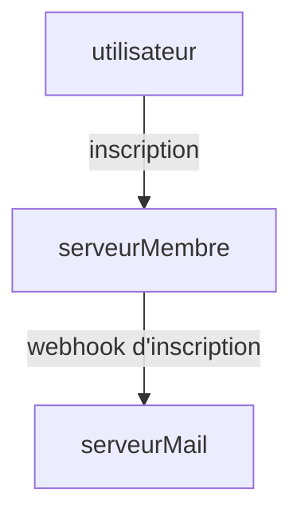

## Qu'est-ce qu'un webhook ?
En général, les requêtes sont envoyées par le client au serveur, et le serveur renvoie une réponse au client. (structure de requête-réponse)

Les webhooks sont généralement utilisés pour informer des actions de l'utilisateur qui se produisent de manière non périodique. Par exemple, dans une architecture MSA où le serveur de notifications et le serveur d'inscription sont séparés, lorsqu'un utilisateur s'inscrit sur un site web, une notification par e-mail est envoyée pour l'informer de son inscription.



En réalité, ce n'est pas une fonctionnalité incroyablement complexe, et il n'y a pas de grande différence avec des requêtes classiques. Il suffit de comprendre que lorsque certains événements se produisent sur le serveur, une requête est envoyée à un serveur ou client spécifique.

## Tester un webhook
Alors, comment peut-on tester un webhook ?

### 1. Attendre la finalisation
Par exemple, si nous avons un serveur de membres et un serveur de mails, nous pouvons facilement tester en mettant en œuvre tout et en effectuant l'inscription.

Cependant, le point négatif est que si l'équipe est composée de plusieurs membres, chacun devant mettre en œuvre la fonctionnalité de son propre serveur, il sera nécessaire d'attendre la mise en œuvre de toutes les fonctionnalités pour tester un seul webhook.

### 2. Implémenter un serveur de simulation
Une autre méthode consiste à implémenter vous-même un serveur de simulation.

Puisque le but est de recevoir des requêtes, il suffit de créer un serveur avec un certain point de terminaison (en supposant un serveur mail) et d'envoyer simplement la requête lors de la réussite de l'inscription.

Par exemple, cela pourrait ressembler à ceci.
```go
package main

import (
    "fmt"
    "net/http"
)

func main () {
    http.HandleFunc("/webhook", func(w http.ResponseWriter, r *http.Request) {
        fmt.Fprintln(w, "Webhook reçu !")
    })

    http.ListenAndServe(":8080", nil)
}
```

De cette manière, nous pouvons implémenter le serveur et envoyer une requête à `/webhook` lorsque l'utilisateur s'inscrit.

Cependant, cette méthode n'est pas vraiment recommandée, car honnêtement, cela prend du temps, et chaque fois qu'une nouvelle fonctionnalité apparaît, il faut ajouter un point de terminaison correspondant, ce qui peut devenir un inconvénient.

### 3. Utiliser webhook.site
Il existe un site qui peut être utilisé dans de tels cas, c'est [webhook.site](https://webhook.site).

Ce site reçoit des requêtes et permet de vérifier comment les réponses de ces requêtes sont arrivées.

Considérez-le comme un serveur de simulation qui reçoit toutes les requêtes.

Comme son nom [webhook.site](https://webhook.site) l'indique, il a été conçu à la base pour tester les fonctions de webhook.

Lorsque vous accédez au site, une URL de webhook unique est générée pour votre propre utilisation dans le champ `Your unique URL`.


Il ne reste plus qu'à envoyer une requête à cette URL. Dans mon cas, j'ai utilisé curl pour envoyer la requête.

```bash
curl -X POST https://webhook.site/f5fcf7e6-2233-4374-8c73-32195b38e7fb -H "Content-Type: application/json" -d '{"name":"test"}'
```

Ainsi, vous pouvez vérifier tous les détails concernant la requête, comme les requêtes qui sont entrées, le corps envoyé, les en-têtes, etc.

