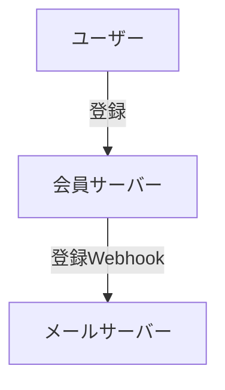

## Webhookとは？
一般的にリクエストはクライアントからサーバーに送信され、サーバーはクライアントに応答を返す構造になっています。（リクエスト-レスポンス構造）

通常、非定期的に発生するユーザーの行動を知らせる目的で使用され、例えば、通知サーバーと会員サーバーが分離されたMSA構造の場合、ユーザーがウェブサイトに登録をすると、登録を知らせるメールを送るようなケースです。



実際には非常に大きな機能ではなく、一般的なリクエストと大差ありません。サーバーで特定のイベントが発生した時に、特定のサーバーやクライアントにリクエストを送信することを知っていれば大丈夫です。

## Webhookのテスト
では、Webhookはどのようにテストできるでしょうか？

### 1. 完成を待つ
例えば、会員サーバーとメールサーバーがある場合、すべて実装して登録を試みることで簡単にできるかもしれません。しかし、欠点は、チームメンバーが複数いる場合、各自がサーバーの機能を実装すると、Webhookのテストのためにすべての機能の実装を待たなければならない点です。

### 2. ダミーサーバーを実装する
また、ダミーサーバーを自分で実装する方法もあります。

結局、リクエストを受けることが目的なので、特定のエンドポイント（メールサーバーを仮定）を持つサーバーを作成し、会員登録に成功した時にリクエストを送信すればよいのです。

例えば、このような感じになります。
```go
package main

import (
    "fmt"
    "net/http"
)

func main () {
    http.HandleFunc("/webhook", func(w http.ResponseWriter, r *http.Request) {
        fmt.Fprintln(w, "Webhook received!")
    })

    http.ListenAndServe("8080", nil)
}
```

このようにサーバーを実装し、会員登録時に`/webhook`にリクエストを送ればよいのです。

ただし、この方法はあまりおすすめしません。正直言って作るのが面倒だし、こういう機能が増えるたびにそれぞれに応じたエンドポイントを追加しなければならない点が欠点です。

### 3. webhook.siteを利用する
こうした場合に使えるサイトがあります。まさに[webhook.site](https://webhook.site)です。

このサイトはリクエストを受け、該当リクエストの応答がどのように来たのか確認できるサイトです。

いわゆる、すべてのリクエストを受けるダミーサーバーだと思っていただければいいでしょう。

名前が[webhook.site](https://webhook.site)であるため、基本的にWebhook機能をテストするために作られました。

サイトにアクセスすると、基本的に`Your unique URL`の欄に自分だけが使えるWebhook URLが生成されます。


では、このURLにリクエストを送信します。私のケースではcurlを使ってリクエストを送ってみました。

```bash
curl -X POST https://webhook.site/f5fcf7e6-2233-4374-8c73-32195b38e7fb -H "Content-Type: application/json" -d '{"name":"test"}'
```

すると、隣にどのリクエストが来たか、どのボディで、ヘッダーはどのようだったかなど、リクエストに関するすべての事項を確認できます。


