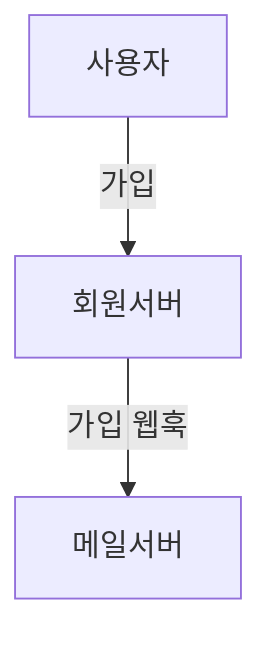

## 웹훅이란?
일반적으로 요청은 클라이언트가 서버에게 보내고 서버는 클라이언트에게 응답을 보내는 구조로 되어있다. (요청-응답 구조)

일반적으로 비주기적으로 일어나는 사용자의 행동을 알려주는 용도로 사용되는데, 예컨데 알림 서버와 회원 서버가 분리되어 있는 MSA 구조라고 할 때 사용자가 웹사이트에 가입을 하면 가입을 알리는 메일을 보내는 것과 같은 경우이다.



사실 엄청나게 큰 기능은 아니고, 일반적인 요청과 크게 다를 것은 없다. 서버에서 특정 이벤트가 생겼을 때 특정 서버나 클라이언트에게 요청을 보낸다고 알고 있으면 된다.

## 웹훅 테스트 하기
그럼 웹훅은 어떻게 테스트 할 수 있을까?

### 1. 완성을 기다리기
예를 들어 회원서버와, 메일 서버가 있다면 모두 구현해서 가입을 해본다던지 하면 쉽게 할 수 있을 것이다. 

다만 단점은, 만약 팀원이 여러명이라면 각자 서버의 기능을 구현한다고 하면, 웹훅 하나의 테스트를 위해 모든 기능의 구현을 기다려야 한다는 점이 단점이 될 수 있겠다.

### 2. 더미서버 구현하기
혹은 더미서버를 직접 구현하는 방법도 있다.

어차피 요청을 받는 것이 목적이기 때문에, 특정 엔드포인트(메일 서버를 가정)를 가진 서버를 만들어두고 회원가입 성공 시 요청만 보내면 된다.

예를 들면 이런 느낌일 것이다.
```go
package main

import (
    "fmt"
    "net/http"
)

func main () {
    http.HandleFunc("/webhook", func(w http.ResponseWriter, r *http.Request) {
        fmt.Fprintln(w, "Webhook received!")
    })

    http.ListenAndServe(":8080", nil)
}
```

이런 식으로 서버를 구현하고, 회원가입 시 `/webhook`으로 요청을 보내면 된다.

다만 이런 방법은 굳이 추천하지 않는데, 솔직히 만들기도 귀찮기도 하고, 이런 기능이 생길때마다 각각에 맞는 엔드포인트를 추가해야한다는 점이 단점이 될 수 있다.

### 3. webhook.site 사용하기
이런 경우에 사용할 수 있는 사이트가 있다. 바로 [webhook.site](https://webhook.site)이다.

이 사이트는 요청을 받고, 해당 요청의 응답이 어떻게 왔는지 확인할 수 있는 사이트이다.

일종의 모든 요청을 받는 더미 서버라고 생각하면 된다.

이름이 [webhook.site](https://webhook.site)인 만큼 기본적으로 웹훅 기능을 테스트하기 위해 태어났다.

사이트에 접속을 하면 기본적으로 `Your unique URL` 란에 본인만 사용할 수 있는 웹훅 URL이 생성된다.


이제 해당 URL에 요청을 보내면 된다. 필자의 경우 curl을 통해 요청을 보내보았다.

```bash
curl -X POST https://webhook.site/f5fcf7e6-2233-4374-8c73-32195b38e7fb -H "Content-Type: application/json" -d '{"name":"test"}'
```

그럼 옆에 어떤 요청이 들어왔는지 부터, 어떤 Body로 왔는지, 헤더는 어떤지 등 요청에 대한 모든 사항을 확인할 수 있다.


