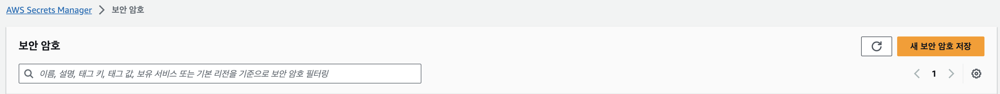
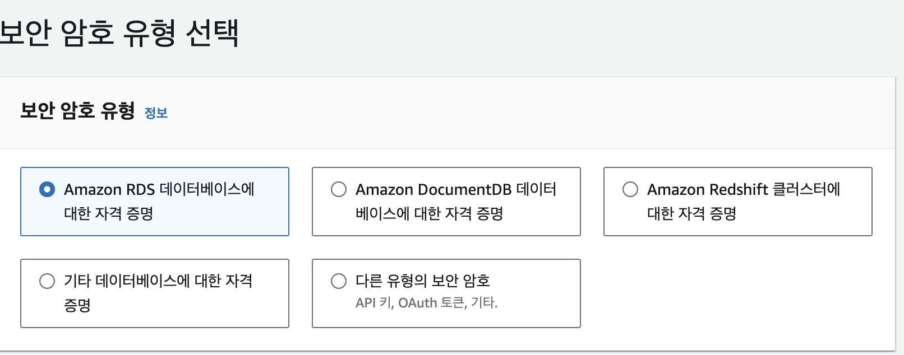
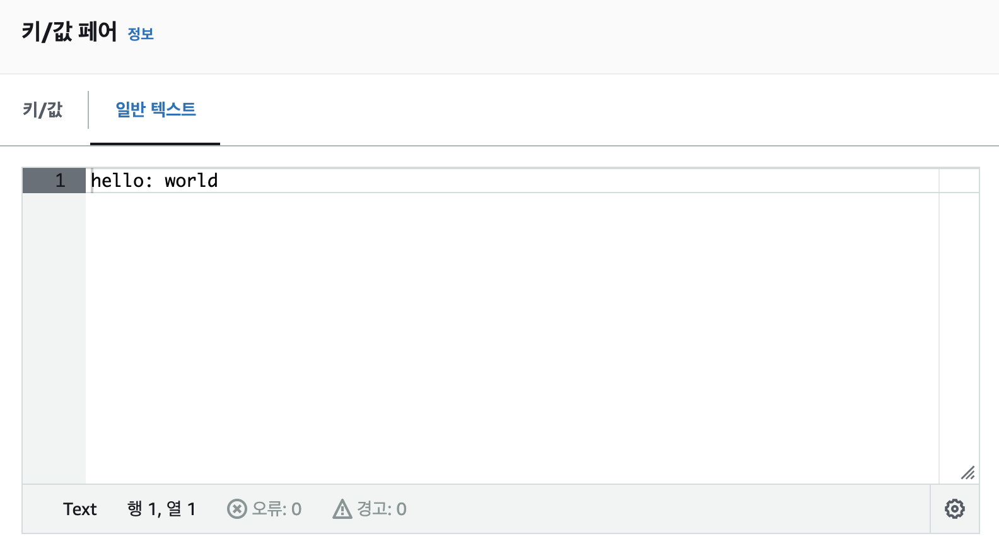
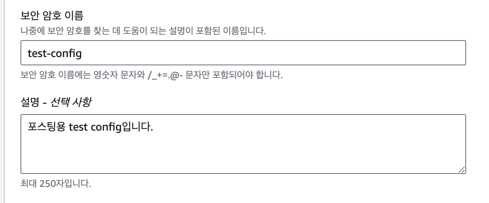
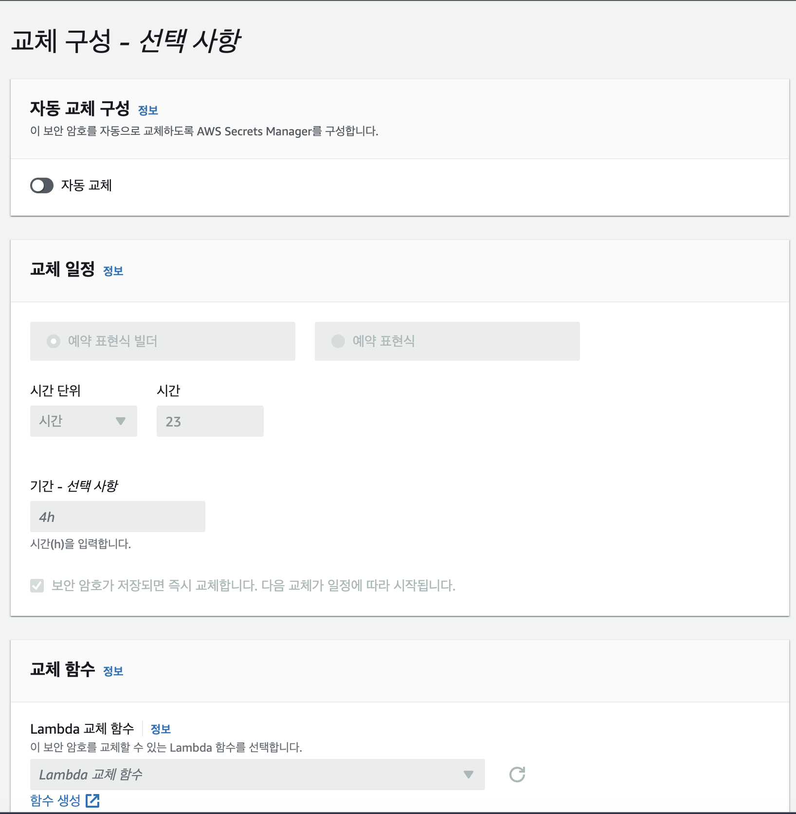
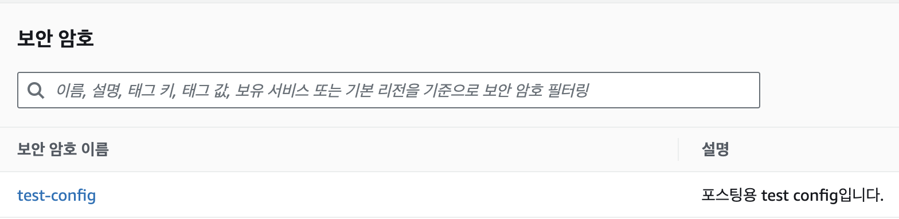

# 개요

회사에서 로컬로 시크릿을 공유하다 보면 Slack, 카카오톡 과 같은 메신저를 통해 시크릿을 주고 받는 일이 종종 생긴다.

이유는 종종 다음과 같은데
1. 변경 사항에 대한 대응으로 기존 로컬 Secret를 갱신해야 하는 경우
2. 신규 입사 시 초기 Secret를 설정해야하는 경우

이런 방법은 메신저라는 공유 채널에 Secret에 대한 민감한 정보가 남기도 하고, 여러가지 보안적인 측면에서 좋지 못하다고 느꼈다.

# AWS Secret Generator
그래서 만들었다. Golang으로 제작한 간단한 CLI 툴이며, AWS Secrets Manager에서 보관 중인 Secret들을 간단한 CLI를 통해 가져오고 로컬에 파일의 형태로 가져올 수 있다.

## Usage
### 준비물
- AWS Access Key ID, AWS Secret Access Key 는 사전에 공유되어 있음을 가정한다.

- AWS Secrets Manager 셋업
	- 먼저 Secrets Manager에 들어가서 설정을 셋업한다. 해당 란에서 `새 보안 암호 저장`을 선택
		
	- 보안 암호 유형을 선택한다. 필자는 여러가지 설정이 포함된 복합적인 형태의 config를 셋업하는 시나리오를 고려하여 다른 유형의 보안암호를 설정하였다. (AWS와 관련된 서비스의 특정 Secret을 설정하고 싶다면 다른 유형의 보안암호를 선택해도 좋다.)
		
	- 일반 텍스트 형식을 탭하여, 현재 사용하고 있는 local secrets의 파일을 복사 붙여넣기 하여 생성한다.
		- 키 값 페어를 사용하여 JSON형태로 강제하는 방식도 물론 가능하다.
		- 필자는 yaml 형식으로 `hello: world`와 같은 단순한 secrets를 사용한다고 가정했다.
			- 실제 config를 셋업할 때는 local에서 구동가능한 config를 셋업하여야 한다.
		
	- 보안 암호명,  설명을 입력한다. 보안 암호명은 이후 과정에서 cli프로그램에서 선택하는 키 값이 되므로, 잘 기억해두도록 한다.
		
	- 설정한 Secrets를 주기적으로 다른 Secrets로 교체시킬 것인지에 대한 부분이다. 필자는 따로 해당 기능을 사용하지 않는다고 가정했기 때문에 설정하지 않았다.
		
	- 다음 스탭에서 저장 버튼을 누르면 Secrets가 생성된다.
		  
- 전반적인 CLI 설치는 다음 레파지토리의 설명을 따른다.
	- https://github.com/YangTaeyoung/aws-secret-gen
- aws-secret-gen 사용하기
	- 커맨드 라인에 다음을 입력한다.
	```bash
	$ aws-secret-gen -o test-config.yaml{저장할 파일 경로}
	```
	- 그럼 다음과 같이 AWS Access Key ID와 Secret Access Key, Region을 설정하는 창이 나온다.
		- 사전에 준비한 키와 리전을 입력하도록 한다.
		```bash
		>  Enter AWS Access Key ID: {준비한 AWS Access Key ID}
		>  Secret AWS Secret Access Key: {준비한 AWS Secret Access Key}
		>  Enter AWS Region: {AWS Region 키: 서울인 경우 ap-northeast-2}
	   ```
	- 이후 시크릿 리스트가 뜬다. 본인이 생성한 Secret를 가져온다.
	```bash
	Use the arrow keys to navigate: ↓ ↑ → ←
	? Select Secret:
		...
	  ▸ test-config
	```
	- 엔터를 누르면 본인이 설정한 경로에 시크릿이 잘 생성되었음을 확인할 수 있다.
	```bash
	$ cat ./test-config.yaml
	> hello: world
	```