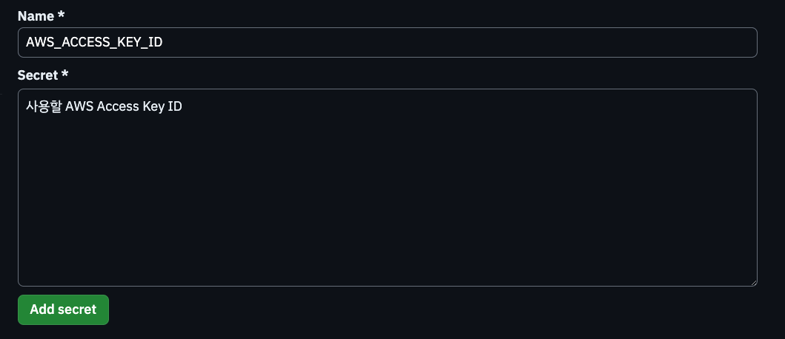
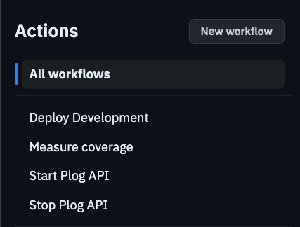
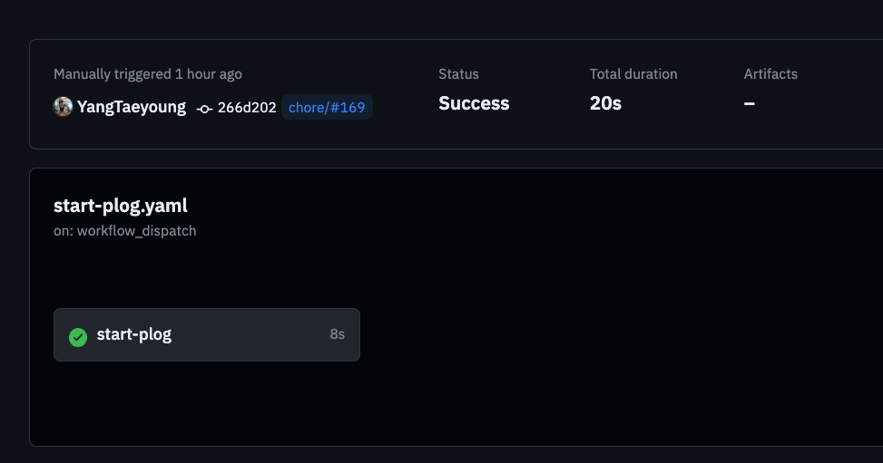

## Table of contents
{: .no_toc .text-delta }

1. TOC 
{:toc}
---

AWS ECS로 배포했던 [Plog](https://github.com/project-565)("개발자들의 블로그 만들기 프로젝트")를 마무리 하게 되면서, 서버 유지 보수 비용을 가변적으로 컨트롤 하고 싶었다.

~~_(공부목적으로 시작한 것이지, 돈을 벌기 위해 유지하는 서비스는 아니니까.. 돈을 아껴야지..)_~~ 

ECS 비용이 별건 아니지만, 그래도 의미없게 유지할 필요는 없다고 생각했다. 다만, 팀원들이 언제나 이직이나 취직 시에 포트폴리오로 활용할 수 있도록 API서버를 올렸다가 내렸다가 하는 것을 구상하려 한다. 

# ECS 서비스 종료는 어떻게 하는가?
사실 매우 간단하다. ECS 서비스의 원하는 테스크 수를 0으로 설정하면 된다. 반대로 시작할 때는 원하는 테스크 수를 원하는 컨테이너 수로 설정하면 된다.
> 주의할 점은 해당 방식은 절대 배포하는 방법을 의미하지 않는다. 이미 생성된 컨테이너를 종료하고, 다시 시작하는 것을 의미한다.

## AWS CLI
기존에는 [AWS CLI](https://aws.amazon.com/koa/cli/) 명령어를 자동화하여 사용하려고 했다. 방법도 알았으나, 결론은 Github Action을 이용하게 되었다.
이유는 다음과 같았다.
1. 프론트 팀원은 AWS 에 대해 그다지 익숙하지 않았다.
2. AWS Client의 명령어를 사용하려면 AWS Access Key와 Secret Key를 사용해야 하는데, 이를 팀원들끼리 공유하여 사용하는 것은 그다지 우아해보이진 않았다.

### Steps
1. AWS Access Key ID와 AWS Secret Access Key를 팀원들끼리 공유한 후 [AWS CLI](https://aws.amazon.com/koa/cli/)를 설치한다.
2. AWS Configure를 통해 Access Key와 Secret Key를 입력하여 설정을 마무리 한다.
    ```bash
    $ aws configure
    > AWS Access Key ID [None]: {AWS_ACCESS_KEY_ID}
    > AWS Secret Access Key [None]: {AWS_SECRET_ACCESS_KEY}
    > Default region name [None]: {AWS_REGION}
    > Default output format [None]: {AWS_OUTPUT_FORMAT}
    ```
3. AWS Client를 통해 ECS 서비스를 시작하고 종료한다.
    ```bash
    $ aws ecs update-service --cluster plog-cluster --service plog-service --desired-count 0 # 서비스 종료
    $ aws ecs update-service --cluster plog-cluster --service plog-service --desired-count 원하는 테스크 수 # 서비스 시작
    ```


# Github Action
Github Action은 Github에서 제공하는 CI/CD 서비스이다. Github에서 제공하는 다양한 Action을 통해 CI/CD를 구성할 수 있다.

강력한 장점 중 하나는 Github Secrets인데, Github에서 제공하는 비밀 키 관리 시스템이다. Github Action을 통해 배포할 때, Github Secrets에 저장된 비밀 키를 사용할 수 있다.

해당 기능을 통해 앞서 말했던 AWS Access Key와 Secret Key를 직접 입력하지 않고, Github Secrets를 통해 등록하여 Github Action에서 활용할 수 있었다.

## Steps
1. Github Secrets에 AWS Access Key와 Secret Key를 등록한다. 
   a. Github Repository > Settings > Secrets > New repository secret에서 `AWS_ACCESS_KEY_ID`, `AWS_SECRET_ACCESS_KEY를` 등록한다. 필자는 ECS 배포 시 ECR 주소가 `AWS_ACCOUNT_ID`를 포함하고 있어 `AWS_ACCOUNT_ID`를 추가로 등록해두었다.
   

   

2. ECS 서비스 시작 워크플로우 파일 `project-root/.github/workflows/start-ecs.yaml` 생성
   ```yaml
   name: Start ECS Service
   
   on:
     workflow_dispatch:
   
   env:
     ECS_CLUSTER: 생성한 ECS 클러스터 이름
     ECS_SERVICE: 생성한 ECS 서비스 이름
   
   jobs:
     start-plog:
       runs-on: ubuntu-latest
   
       steps:
         - name: Checkout
           uses: actions/checkout@v2
   
         - name: Start ECS Service
           run: |
             aws ecs update-service --cluster ${{ env.ECS_CLUSTER }} --service ${{ env.ECS_SERVICE }} --desired-count 1
           env:
             AWS_ACCESS_KEY_ID: ${{ secrets.AWS_ACCESS_KEY_ID }}
             AWS_SECRET_ACCESS_KEY: ${{ secrets.AWS_SECRET_ACCESS_KEY }}
             AWS_DEFAULT_REGION: "AWS 리전"
   ```
3. ECS 서비스 종료 워크플로우 파일 `project-root/.github/workflows/stop-ecs.yaml` 생성
   ```yaml
   name: Stop ECS Service
   
   on:
      workflow_dispatch:
   
   env:
     ECS_CLUSTER: 생성한 ECS 클러스터 이름
     ECS_SERVICE: 생성한 ECS 서비스 이름
   
   jobs:
      stop-plog:
         runs-on: ubuntu-latest
   
         steps:
            - name: Checkout
              uses: actions/checkout@v2
   
            - name: Start ECS Service
              run: |
                 aws ecs update-service --cluster ${{ env.ECS_CLUSTER }} --service ${{ env.ECS_SERVICE }} --desired-count 0
              env:
                 AWS_ACCESS_KEY_ID: ${{ secrets.AWS_ACCESS_KEY_ID }}
                 AWS_SECRET_ACCESS_KEY: ${{ secrets.AWS_SECRET_ACCESS_KEY }}
                 AWS_DEFAULT_REGION: "AWS 리전"
   ```
   
두 액션 모두 desired-count만 제외하면 동일하다. `desired-count`는 원하는 테스크 수를 의미한다. `0`으로 설정하면 서비스가 종료되고, `1`로 설정하면 서비스가 시작된다.

아래  사진에서 1개 필요 부분이 변경된다고 보면 된다. ECS는 지정한 테스크 수에 따라 컨테이너 수를 조정한다.


각 `yaml` 파일에서 `on`을 `workflow_dispatch`로 설정한 이유는 Github Action을 수동으로 실행하기 위함이다.


`name` 은 적절하게 설정하면 액션 리스트에서 보기 좋다.



# Summary
Github Action을 통해 ECS 서비스를 시작하고 종료하는 방법을 알아보았다. Github Action을 통해 AWS ECS를 배포하는 것은 추후에 다루도록 하겠다.



