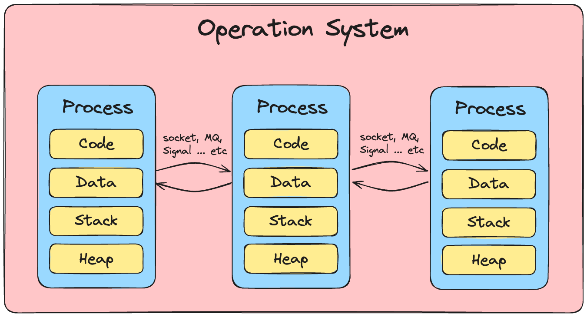
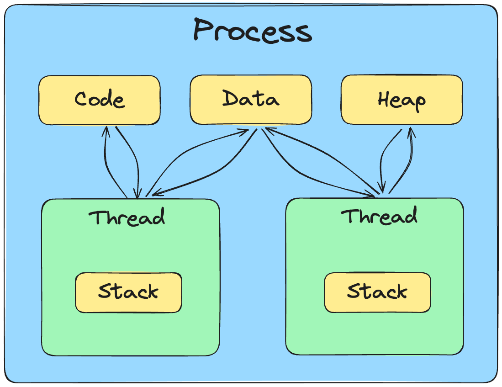

## Table of contents
{: .no_toc .text-delta }

1. TOC
{:toc}

# 프로그램
프로세스를 이해하기 위해서는 프로그램이 무엇인지 알아야 한다.

프로그램은 진행 절차나 순서를 명시한 문서로, 컴퓨터에서는 하드 디스크 내에 저장된다.

# 프로세스
프로세스는 실행 중인 프로그램으로 디스크로부터 메모리에 적재되어 CPU의 할당을 받을 수 있는 것을 말한다.

프로세스는 프로그램을 수행하는데 필요한 데이터와 메모리 등의 자원 그리고 쓰레드로 구성되어 있다.

## 프로세스가 할당 받는 OS 자원 예시
- **CPU 시간**
  - CPU 시간은 프로세스가 실제로 CPU를 사용하는 시간을 의미한다. CPU 시간은 크게 사용자 CPU 시간과 커널 CPU 시간으로 구분된다.
    - **사용자 CPU 시간**: 유저 모드에서 실행되는 시간
    - **커널 CPU 시간**: 커널 모드에서 실행되는 시간
      - _커널: 운영체제의 핵심 부분으로, 하드웨어와 응용 프로그램을 연결해주는 역할을 한다._
- **메모리**
  - **Code**: 프로그램 코드가 저장되는 영역
    - 실행되는 코드 자체를 의미한다. 여기서 코드란 프로그래머가 작성한 코드가 아니라 컴파일러가 기계어로 번역한 코드를 의미한다.
  - **Data**: 전역 변수가 저장되는 영역
    - 전역 변수는 프로그램 전체에서 사용되는 변수를 의미한다. 전역 변수는 프로그램의 데이터 영역에 저장된다.
  - **Stack**: 지역 변수가 저장되는 영역
    - 지역 변수는 함수 내에서 선언되어 함수가 호출될 때 생성되고 함수가 종료되면 소멸하는 변수를 의미한다. 지역 변수는 스택 영역에 저장된다.
  - **Heap**: 동적 할당 변수가 저장되는 영역
    사용자가 직접 관리할 수 있는 변수를 의미한다. 동적 할당 변수는 힙 영역에 저장된다.
- **파일 및 I/O 장치**
  - 프로세스는 실행 중에 필요한 데이터를 메모리에 적재하고, 실행 결과를 메모리에서 파일이나 I/O 장치로 쓰기도 한다.

## 프로세스 간 메모리 공유
- 프로세스는 각각 독립된 메모리 영역을 할당받아 사용한다. 따라서 프로세스는 다른 프로세스의 메모리에 직접 접근할 수 없다. 
- 따라서 프로세스 간에는 적절한 통신 방법을 사용해야 한다.

### 프로세스 간 통신 방법
- **파이프**
  - 파이프는 한 프로세스가 다른 프로세스로부터 데이터를 전달받을 수 있도록 한다. 파이프는 한쪽 방향으로만 통신이 가능하다.
- **메시지 큐**
  - 메시지 큐는 데이터를 메시지라는 단위로 주고받을 수 있도록 한다. 메시지 큐는 양방향 통신이 가능하다.
- **공유 메모리**
  - 공유 메모리는 두 프로세스가 모두 접근 가능한 메모리를 사용하는 방식이다. 공유 메모리는 두 프로세스가 동시에 접근할 수 있기 때문에 동기화 문제가 발생할 수 있다.
- **소켓**
  - 소켓은 네트워크를 통해 데이터를 주고받을 수 있도록 한다. 소켓은 양방향 통신이 가능하다.
- **신호**
  - 신호는 프로세스에게 어떤 이벤트가 발생했는지 알려준다. 프로세스는 신호를 받으면 해당 이벤트를 처리한다.
- **파일**
  - 파일은 하드디스크에 저장된 데이터를 읽고 쓸 수 있도록 한다. 파일은 양방향 통신이 가능하다.

## 프로세스 상태
프로세스는 상태가 변경되며 수행된다. 프로세스는 다음과 같은 상태를 가진다.

- **실행 상태**
  - 프로세스가 CPU를 점유하고 명령어를 실행하고 있는 상태이다.
- **준비 상태**
  - 프로세스가 CPU를 사용하고 있지는 않지만, 다른 프로세스가 CPU를 사용하고 있어서 언제든지 실행될 수 있는 상태이다.
- **대기 상태**
  - 프로세스가 CPU를 사용하고 있지 않고, 입출력 등의 이벤트를 기다리는 상태이다.
- **생성 상태**
  - 프로세스가 생성되어 메모리를 할당받은 상태이다.
- **종료 상태**
  - 프로세스의 실행이 종료되고 메모리가 해제된 상태이다

# 스레드
스레드는 프로세스 내에서 실행되는 여러 흐름의 단위이다. 스레드는 프로세스가 할당받은 자원을 이용해서 실제로 작업을 수행하는 주체이다.

## 스레드의 특징
- 프로세스 내에서 각각 Stack만 따로 할당받고 Code, Data, Heap 영역은 공유한다.
- 프로세스 내에서 각각 별도의 PC와 SP를 가지고 있다.
- 프로세스 내에서 각각 별도의 레지스터 집합을 가지고 있다.

## 스레드의 장점
- 시스템 자원 소모가 줄어든다.
  - 스레드는 프로세스 내의 자원을 공유하기 때문에 프로세스를 생성하여 자원을 할당하는 시스템 콜이 줄어든다.
- 스레드 간 통신이 간단하다.
  - 스레드는 프로세스 내의 자원을 공유하기 때문에 통신이 간단하다.
- 스레드의 context switch가 빠르다.
  - 스레드는 Stack만 따로 할당받고 Code, Data, Heap 영역을 공유하기 때문에 context switch가 빠르다.
- 스레드의 생성이 빠르다.
  - 스레드는 프로세스 내의 자원을 공유하기 때문에 프로세스를 생성하는 것보다 스레드를 생성하는 것이 빠르다.
- 스레드의 종료가 빠르다.
  - 스레드는 프로세스 내의 자원을 공유하기 때문에 프로세스를 종료하는 것보다 스레드를 종료하는 것이 빠르다.
- 스레드의 동기화가 간단하다.
  - 스레드는 프로세스 내의 자원을 공유하기 때문에 동기화가 간단하다.

# Epilogue
- 면접을 보다, 막상 떠올리지 못해 대답을 잘 하지 못해서 아쉬움의 포스팅을 남긴다.
-  _담부턴 실수하지 말아야지_